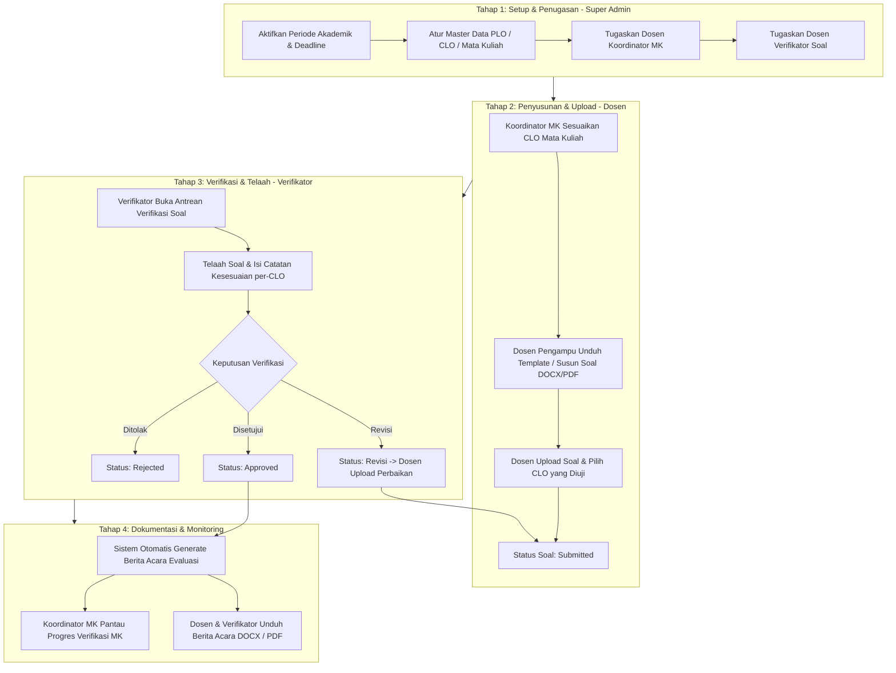

# Sistem Verifikasi Soal Ujian

Aplikasi web modern untuk mengelola siklus pengunggahan, verifikasi/telaah soal ujian, monitoring, capaian pembelajaran (PLO & CLO), serta dokumentasi Berita Acara berbasis kurikulum OBE (Outcome-Based Education). Dibangun dengan fokus utama untuk **Program Studi Sistem Informasi**, Fakultas Rekayasa Industri, Telkom University.

---

## Daftar Isi

1. [Ringkasan Sistem](#1-ringkasan-sistem)
2. [Role & Hak Akses](#2-role--hak-akses)
3. [Alur Proses Bisnis](#3-alur-proses-bisnis)
4. [Fitur Utama per Peran](#4-fitur-utama-per-peran)
5. [State Machine Soal Ujian](#5-state-machine-soal-ujian)
6. [Tech Stack](#6-tech-stack)
7. [Struktur Proyek](#7-struktur-proyek)
8. [Skema Entitas Data Utama](#8-skema-entitas-data-utama)
9. [Generator Lembar Soal & Berita Acara](#9-generator-lembar-soal--berita-acara)
10. [Panduan Instalasi & Pengujian](#10-panduan-instalasi--pengujian)

---

## 1. Ringkasan Sistem

Sistem Verifikasi Soal mendigitalkan dan mengotomatiskan seluruh alur verifikasi naskah soal ujian di lingkungan perguruan tinggi:

- **Pengelolaan Master PLO & CLO**: Master capaian pembelajaran (PLO) dan capaian pembelajaran mata kuliah (CLO) Kurikulum 2024 berdiri secara independen dari periode akademik dan dipetakan langsung ke mata kuliah (`course_clo`).
- **Pemisahan Peran Koordinator MK & Verifikator Soal**:
  - **Super Admin**: Mengatur periode, menugaskan Koordinator MK dan Dosen Verifikator Soal untuk masing-masing mata kuliah.
  - **Dosen Koordinator MK**: Mengkoordinasikan mata kuliah, mengelola CLO mata kuliah, memantau verifikator yang ditunjuk Super Admin, serta memantau progres verifikasi soal mata kuliah yang dipegang.
  - **Dosen Verifikator Soal**: Menelaah naskah soal ujian masuk antrean, memeriksa kesesuaian soal terhadap CLO, memberikan catatan per-CLO, dan menyetujui/meminta revisi naskah soal.
  - **Dosen Biasa / Pengampu**: Menyusun dan mengunggah soal ujian mandiri, memantau riwayat revisi, serta mengunduh Berita Acara.
- **Integritas & Otomasi Verifikasi**: Dosen yang mengunggah soal tidak dapat memverifikasi soalnya sendiri.
- **On-the-Fly Document Generation**: Sistem dapat men-generate dokumen resmi (Lembar Soal Standar & Berita Acara Evaluasi Soal Ujian) secara langsung dalam format **Word (DOCX)** maupun **PDF**.

---

## 2. Role & Hak Akses

| Role | Sifat Penugasan | Deskripsi Singkat |
| :--- | :--- | :--- |
| **Super Admin** | Akun Administrator | Mengelola konfigurasi sistem secara penuh: akun dosen, periode & deadline, master mata kuliah, penugasan Koordinator MK, penugasan Verifikator Soal, monitoring prodi, dan template dokumen. |
| **Koordinator MK** | Dinamis per Periode Aktif | Dosen yang ditunjuk Super Admin untuk mengkoordinasikan mata kuliah tertentu pada periode berjalan. Bertanggung jawab atas pengelolaan PLO & CLO mata kuliah serta memantau verifikator yang ditunjuk Super Admin. |
| **Verifikator Soal** | Dinamis per Periode Aktif | Dosen yang ditunjuk Super Admin untuk menelaah naskah soal ujian pada mata kuliah tertentu. Memiliki wewenang telaah per CLO, menyetujui/meminta revisi soal, dan menandatangani Berita Acara. |
| **Dosen Pengampu (Biasa/LB)** | Akun Dosen Pengampu | Dosen pengampu mata kuliah yang menyusun & mengunggah naskah soal ujian sebelum tenggat waktu, menindaklanjuti revisi dari verifikator, dan mengunduh Berita Acara. |

### Matriks Hak Akses & Fitur

| Fitur / Modul | Super Admin | Koordinator MK | Verifikator Soal | Dosen Biasa / LB |
| :--- | :---: | :---: | :---: | :---: |
| **Dashboard Khusus Peran** | ✅ (Super Admin) | ✅ (Koordinator MK) | ✅ (Verifikator) | ✅ (Dosen Pengampu) |
| **Manajemen Dosen (CRUD)** | ✅ | ❌ | ❌ | ❌ |
| **Kelola Periode & Deadline** | ✅ | ❌ | ❌ | ❌ |
| **Penugasan Koordinator MK** | ✅ | ❌ | ❌ | ❌ |
| **Penugasan Verifikator Soal** | ✅ (CRUD) | ❌ | ❌ | ❌ |
| **Monitoring Verifikator Soal** | ✅ | ✅ (MK Koordinasi) | ❌ | ❌ |
| **Kelola Master PLO & CLO** | ✅ | ✅ (MK Koordinasi) | ❌ (View Only) | ❌ (View Only) |
| **Upload Naskah Soal Mandiri** | ✅ | ✅ | ✅ | ✅ |
| **Antrean Verifikasi Soal** | ✅ | ❌ | ✅ (MK Ditugaskan) | ❌ |
| **Catatan Telaah per-CLO** | ✅ | ❌ | ✅ | ❌ |
| **Monitoring Progres Prodi** | ✅ | ❌ | ❌ | ❌ |
| **Berita Acara Evaluasi (Download/Print)** | ✅ | ✅ | ✅ | ✅ |

---

## 3. Alur Proses Bisnis



---

## 4. Fitur Utama per Peran

### 1. Super Admin
- **Dashboard Super Admin**: Ringkasan sistem, total soal, progres verifikasi fakultas/prodi, status periode, dan status pengunggahan dosen.
- **Manajemen Akun Dosen**: CRUD data dosen lengkap dengan kode dosen, email Telkom University, tipe dosen (Biasa / LB), dan semester LB.
- **Manajemen Periode & Deadline**: Membuat periode baru (Ganjil/Genap), menetapkan tanggal mulai dan tenggat waktu (deadline), serta aktivasi periode.
- **Penugasan Koordinator MK**: Menugaskan dosen sebagai penanggung jawab mata kuliah pada periode aktif (`penugasan_koordinator`).
- **Penugasan Verifikator Soal**: Menugaskan satu atau lebih dosen verifikator untuk mata kuliah pada periode aktif (`penugasan_verifikator`).
- **Kategori & Template Berita Acara**: Pengelolaan master kategori dan template dokumen.
- **Monitoring Seluruh Soal**: Melihat repositori seluruh berkas naskah soal ujian prodi.

### 2. Dosen Koordinator MK
- **Dashboard Koordinator MK**:
  - 4 Kartu Statistik: *Mata Kuliah Koordinasi*, *Verifikator Ditunjuk*, *Total Soal MK Koordinasi*, dan *Soal Saya Terunggah*.
  - Widget *Verifikator & Progres Mata Kuliah Koordinasi*: Daftar mata kuliah yang dipegang, dosen verifikator yang ditunjuk Super Admin, serta visualisasi progress bar verifikasi soal mata kuliah.
- **Fitur Monitoring Verifikator**: Halaman khusus (`/penugasan-verifikator`) mode pemantauan (*read-only*) yang difilter secara ketat hanya untuk mata kuliah koordinasi dosen yang sedang login.
- **Manajemen PLO & CLO**: Kelola capaian pembelajaran mata kuliah yang dikoordinasikan.
- **Upload & Soal Mandiri**: Menyusun dan mengunggah naskah soal ujian yang diampu sendiri.

### 3. Dosen Verifikator Soal
- **Dashboard Verifikator**:
  - Statistik Antrean Verifikasi, Soal Belum Diverifikasi, Selesai Diverifikasi, dan Soal Mandiri.
  - Diagram donat progress verifikasi dan akses cepat antrean.
- **Antrean Verifikasi Soal (`/verifikasi`)**:
  - Menampilkan daftar naskah soal ujian masuk sesuai mata kuliah tugasnya.
  - Pengecualian otomatis: Tidak dapat memverifikasi soal yang diunggah oleh diri sendiri (*self-review guard*).
  - Form verifikasi interaktif: status (*Approved*, *Revisi*, *Rejected*), catatan umum, dan **catatan telaah per butir CLO** (*Sesuai*, *Perlu Revisi*, *Tolak*).
- **Generate Berita Acara**: Otomatisasi pembuatan Berita Acara Evaluasi Soal Ujian (BA).

### 4. Dosen Pengampu (Biasa & LB)
- **Dashboard Dosen Pengampu**: Statistik status naskah soal mandiri (*Disetujui*, *Dalam Review*, *Perlu Revisi*), pengingat tenggat waktu deadline, dan widget progress upload mata kuliah yang diampu.
- **Upload Soal Ujian (`/soal`)**: Mengunggah naskah soal (format Word DOCX atau PDF), memilih jenis asesmen (UTS/UAS/Quiz), dan memilih CLO yang diujikan.
- **Riwayat & Timeline Soal**: Menelusuri status soal secara real-time dan melihat riwayat catatan perbaikan dari verifikator.
- **Berita Acara (`/berita-acara`)**: Mengunduh Berita Acara hasil telaah verifikator.

---

## 5. State Machine Soal Ujian

```
 [ Draft ]
    │
    ▼
 [ Submitted ] ──(Masuk Antrean Verifikator)──► [ In Review ]
                                                     │
                                       ┌─────────────┼─────────────┐
                                       ▼             ▼             ▼
                                  [ Approved ]  [ Revisi ]   [ Rejected ]
                                       │             │
                             (Generate BA Otomatis)  ▼
                                                [ Submitted ] (Unggah Revisi)
```

---

## 6. Tech Stack

### Frontend (SPA)
- **Framework**: React 19 + TypeScript + Vite 8
- **Routing & Guard**: React Router 7 dengan Route Guard berbasis Role Dinamis
- **State & Data Fetching**: TanStack Query (React Query) + Axios HTTP Client
- **Styling & UI**: Vanilla Tailwind CSS + Lucide Icons + Recharts
- **Form & Validation**: React Hook Form + Zod Validator
- **Feedback**: Sonner Toast Notifications

### Backend (REST API)
- **Framework**: Laravel 12
- **Autentikasi**: Laravel Sanctum (Token-based API Authentication)
- **Arsitektur**: Controller → Service → Repository → Model Pattern
- **Document Processing**:
  - `phpoffice/phpword` — Pemrosesan & generator otomatis naskah soal dan Berita Acara format Microsoft Word (.docx)
  - `barryvdh/laravel-dompdf` — Generator dokumen PDF on-the-fly
- **Database**: MySQL / PostgreSQL

---

## 7. Struktur Proyek

```
dashboard_verif/
├── app/
│   ├── Enums/                     # SoalStatus, PeriodeStatus, TipeDosen, NotificationType
│   ├── Http/
│   │   ├── Controllers/Api/       # PenugasanKoordinator, PenugasanVerifikator, Soal, Verifikasi, BA, dll.
│   │   ├── Middleware/            # SuperAdminMiddleware, EnsureIsVerifikator, EnsureIsKoordinatorMk
│   │   ├── Requests/              # Form Request Validation (Soal, Dosen, Verifikasi, dll.)
│   │   └── Resources/             # UserResource, SoalResource, VerifikasiResource, dll.
│   ├── Models/                    # User, Course, Periode, Soal, Plo, Clo, PenugasanKoordinator, dll.
│   ├── Repositories/
│   │   ├── Contracts/             # Interface kontrak repository
│   │   └── Eloquent/              # Implementasi Eloquent ORM
│   └── Services/                  # Business Logic (Auth, Soal, Verifikasi, BA, Dashboard, Generator)
│
├── database/
│   ├── migrations/                # Skema basis data
│   └── seeders/                   # Seeder data awal prodi, dosen, dan periode
│
├── resources/
│   ├── js/                        # React SPA Source
│   │   ├── app/                   # App root, Router, Providers
│   │   ├── features/              # Feature modules:
│   │   │   ├── auth/              # Login & sesi
│   │   │   ├── dashboard/         # Role-specific dashboards (Super Admin, Koordinator, Verifikator, Dosen)
│   │   │   ├── plo-clo/           # Master PLO, CLO & mapping kurikulum
│   │   │   ├── soal/              # Unggah soal, timeline, & riwayat revisi
│   │   │   ├── verifikasi/        # Antrean verifikasi soal & form telaah per-CLO
│   │   │   ├── penugasan-koordinator/ # Penugasan Koordinator MK oleh Super Admin
│   │   │   ├── penugasan-pic/     # Penugasan & Monitoring Verifikator Soal
│   │   │   ├── berita-acara/      # Generator & preview Berita Acara
│   │   │   ├── periode/           # Manajemen periode & deadline
│   │   │   ├── kategori/          # Kategori & template soal
│   │   │   ├── dosen/             # Manajemen akun dosen
│   │   │   └── monitoring/        # Monitoring prodi
│   │   └── shared/                # Layouts (Sidebar, Topbar), UI components, hooks, lib
│   └── views/
│       └── templates/             # Blade views untuk template rendering PDF
│
├── routes/
│   ├── api.php                    # REST API endpoints
│   └── web.php                    # SPA entrypoint
│
└── tests/
    └── Feature/                   # Automated feature tests (Sanctum, RBAC, Upload, Verifikasi, BA, Monitoring)
```

---

## 8. Skema Entitas Data Utama

```
users
├── id, uuid, kode_dosen, nama_lengkap, email, password
├── prodi_id (FK -> program_studi)
├── tipe_dosen ('biasa', 'lb'), semester_lb ('ganjil', 'genap')
├── is_super_admin (bool)
└── status_aktif (bool)

courses (Mata Kuliah)
├── id, kode_mk, nama_mk, sks, semester, prodi_id

penugasan_koordinator (Koordinator MK per Periode)
├── id, course_id, dosen_id, periode_id, assigned_by, assigned_at
└── UNIQUE(course_id, periode_id)

penugasan_verifikator (Verifikator Soal per Periode)
├── id, course_id, dosen_id, periode_id, assigned_by, assigned_at
└── UNIQUE(course_id, dosen_id, periode_id)

periodes
├── id, nama_periode, semester ('ganjil', 'genap'), tahun_akademik
├── tanggal_mulai, tanggal_deadline
└── status ('aktif', 'selesai', 'draft')

plo (Program Learning Outcomes)
├── id, kode_plo, deskripsi, prodi_id

clo (Course Learning Outcomes)
├── id, kode_clo, deskripsi, plo_id

course_clo (Mapping CLO ke Mata Kuliah)
└── course_id, clo_id

soal (Naskah Soal Ujian)
├── id, uuid, dosen_id, mata_kuliah_id, periode_id, kategori_id
├── judul_soal, file_soal, jenis_asesmen, status, uploaded_at
└── softDeletes

verifications
├── id, soal_id, verifier_id, status, catatan, verified_at
└── HasMany: verifikasi_clo_notes (clo_id, status_clo, catatan_clo)

berita_acara
├── id, nomor_ba, periode_id, verifier_id, generated_at, file_path
└── HasMany: berita_acara_items (snapshot immutable hasil telaah)
```

---

## 9. Generator Lembar Soal & Berita Acara

Sistem dilengkapi generator dokumen *on-the-fly* berbasis template resmi Telkom University:

1. **Lembar Soal Ujian (DOCX & PDF)**:
   - Endpoint: `/api/lembar-soal/generate` & `/api/lembar-soal/course-structure/{id}`
   - Otomatis mengisi kop fakultas/prodi, data mata kuliah, dosen pengampu, daftar CLO yang diujikan, serta instruksi ujian.
2. **Berita Acara Evaluasi Soal (DOCX & PDF)**:
   - Endpoint: `/api/berita-acara-evaluasi/generate` & `/api/berita-acara-evaluasi/initial-data`
   - Otomatis merangkum snapshot hasil verifikasi soal, persetujuan CLO, tanda tangan dosen verifikator dan koordinator MK.

---

## 10. Panduan Instalasi & Pengujian

### Prasyarat
- PHP >= 8.2 dengan ekstensi `pdo`, `mbstring`, `zip`, `gd`, `xml`
- Composer >= 2.x
- Node.js >= 18.x & NPM
- Database MySQL atau PostgreSQL

### Langkah Instalasi

1. **Clone repository dan install dependensi**:
   ```bash
   composer install
   npm install
   ```

2. **Konfigurasi Environment**:
   ```bash
   cp .env.example .env
   php artisan key:generate
   ```
   Sesuaikan konfigurasi database pada berkas `.env`.

3. **Migrasi Basis Data & Seeding**:
   ```bash
   php artisan migrate --seed
   ```

4. **Kompilasi Frontend & Jalankan Server**:
   ```bash
   # Terminal 1: Vite dev server / Build asset
   npm run build
   # atau untuk mode development: npm run dev

   # Terminal 2: Laravel server
   php artisan serve
   ```

5. **Akses Aplikasi**:
   Buka browser pada `http://127.0.0.1:8000`

### Menjalankan Automated Tests

Aplikasi dilengkapi dengan suite pengujian otomatis menyeluruh:
```bash
# Menjalankan seluruh test suite (45+ tests)
php artisan test

# Menjalankan test khusus monitoring Koordinator MK
php artisan test --filter=PenugasanVerifikatorKoordinatorMonitoringTest
```

---

### Kredensial Akun Default (Seeder)

| Peran | Email | Kata Sandi | Keterangan |
| :--- | :--- | :--- | :--- |
| **Super Admin** | `admin@telkomuniversity.ac.id` | `password` | Akses penuh sistem |
| **Koordinator MK** | `dwn@telkomuniversity.ac.id` | `password` | Koordinator Pengembangan Aplikasi Web (Periode Aktif) |
| **Verifikator Soal** | `ilr@telkomuniversity.ac.id` | `password` | Verifikator Soal Pengembangan Aplikasi Web (Periode Aktif) |
| **Dosen Pengampu** | `shc@telkomuniversity.ac.id` | `password` | Dosen Pengampu |

---
*Dikembangkan untuk Program Studi Sistem Informasi — Fakultas Rekayasa Industri, Telkom University.*
