# Activity Diagram — Dashboard Verifikasi Soal

Berikut activity diagram untuk seluruh *use case* pada sistem **Dashboard Verifikasi Soal** berdasarkan Use Case Diagram yang diberikan.

---

## Aktor: SuperAdmin

### 1. Mengelola Data Dosen

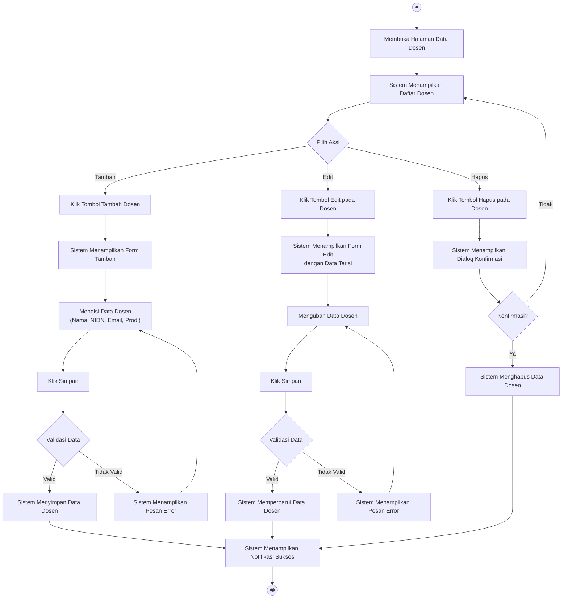
```mermaid
flowchart TD
    A(("●")) --> B["Membuka Halaman Data Dosen"]
    B --> C["Sistem Menampilkan Daftar Dosen"]
    C --> D{"Pilih Aksi"}

    D -->|Tambah| E["Klik Tombol Tambah Dosen"]
    E --> F["Sistem Menampilkan Form Tambah"]
    F --> G["Mengisi Data Dosen\n(Nama, NIDN, Email, Prodi)"]
    G --> H["Klik Simpan"]
    H --> I{"Validasi Data"}
    I -->|Valid| J["Sistem Menyimpan Data Dosen"]
    J --> K["Sistem Menampilkan Notifikasi Sukses"]
    I -->|Tidak Valid| L["Sistem Menampilkan Pesan Error"]
    L --> G

    D -->|Edit| M["Klik Tombol Edit pada Dosen"]
    M --> N["Sistem Menampilkan Form Edit\ndengan Data Terisi"]
    N --> O["Mengubah Data Dosen"]
    O --> P["Klik Simpan"]
    P --> Q{"Validasi Data"}
    Q -->|Valid| R["Sistem Memperbarui Data Dosen"]
    R --> K
    Q -->|Tidak Valid| S["Sistem Menampilkan Pesan Error"]
    S --> O

    D -->|Hapus| T["Klik Tombol Hapus pada Dosen"]
    T --> U["Sistem Menampilkan Dialog Konfirmasi"]
    U --> V{"Konfirmasi?"}
    V -->|Ya| W["Sistem Menghapus Data Dosen"]
    W --> K
    V -->|Tidak| C

    K --> Z(("◉"))
```

---

### 2. Mengelola Periode Verifikasi

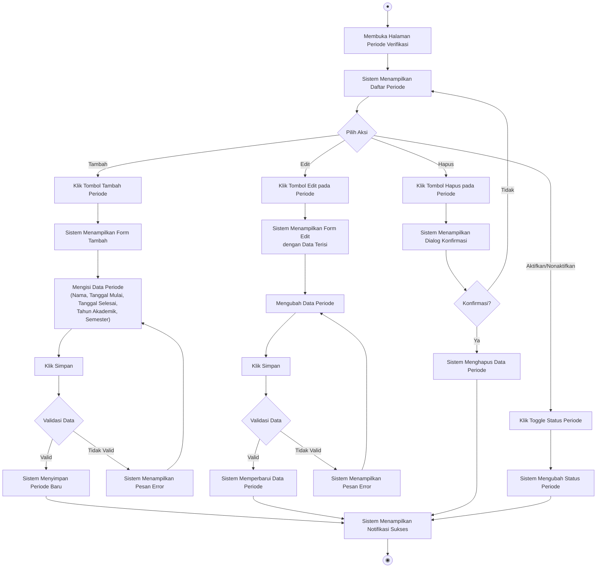
```mermaid
flowchart TD
    A(("●")) --> B["Membuka Halaman Periode Verifikasi"]
    B --> C["Sistem Menampilkan Daftar Periode"]
    C --> D{"Pilih Aksi"}

    D -->|Tambah| E["Klik Tombol Tambah Periode"]
    E --> F["Sistem Menampilkan Form Tambah"]
    F --> G["Mengisi Data Periode\n(Nama, Tanggal Mulai, Tanggal Selesai,\nTahun Akademik, Semester)"]
    G --> H["Klik Simpan"]
    H --> I{"Validasi Data"}
    I -->|Valid| J["Sistem Menyimpan Periode Baru"]
    J --> K["Sistem Menampilkan Notifikasi Sukses"]
    I -->|Tidak Valid| L["Sistem Menampilkan Pesan Error"]
    L --> G

    D -->|Edit| M["Klik Tombol Edit pada Periode"]
    M --> N["Sistem Menampilkan Form Edit\ndengan Data Terisi"]
    N --> O["Mengubah Data Periode"]
    O --> P["Klik Simpan"]
    P --> Q{"Validasi Data"}
    Q -->|Valid| R["Sistem Memperbarui Data Periode"]
    R --> K
    Q -->|Tidak Valid| S["Sistem Menampilkan Pesan Error"]
    S --> O

    D -->|Hapus| T["Klik Tombol Hapus pada Periode"]
    T --> U["Sistem Menampilkan Dialog Konfirmasi"]
    U --> V{"Konfirmasi?"}
    V -->|Ya| W["Sistem Menghapus Data Periode"]
    W --> K
    V -->|Tidak| C

    D -->|Aktifkan/Nonaktifkan| X["Klik Toggle Status Periode"]
    X --> Y["Sistem Mengubah Status Periode"]
    Y --> K

    K --> Z(("◉"))
```

---

### 3. Mengelola Program Studi

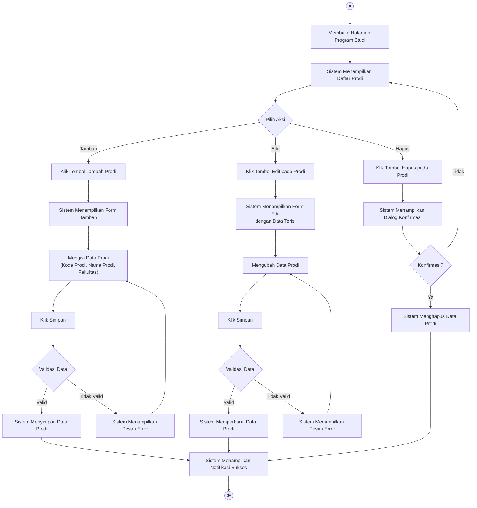
```mermaid
flowchart TD
    A(("●")) --> B["Membuka Halaman Program Studi"]
    B --> C["Sistem Menampilkan Daftar Prodi"]
    C --> D{"Pilih Aksi"}

    D -->|Tambah| E["Klik Tombol Tambah Prodi"]
    E --> F["Sistem Menampilkan Form Tambah"]
    F --> G["Mengisi Data Prodi\n(Kode Prodi, Nama Prodi, Fakultas)"]
    G --> H["Klik Simpan"]
    H --> I{"Validasi Data"}
    I -->|Valid| J["Sistem Menyimpan Data Prodi"]
    J --> K["Sistem Menampilkan Notifikasi Sukses"]
    I -->|Tidak Valid| L["Sistem Menampilkan Pesan Error"]
    L --> G

    D -->|Edit| M["Klik Tombol Edit pada Prodi"]
    M --> N["Sistem Menampilkan Form Edit\ndengan Data Terisi"]
    N --> O["Mengubah Data Prodi"]
    O --> P["Klik Simpan"]
    P --> Q{"Validasi Data"}
    Q -->|Valid| R["Sistem Memperbarui Data Prodi"]
    R --> K
    Q -->|Tidak Valid| S["Sistem Menampilkan Pesan Error"]
    S --> O

    D -->|Hapus| T["Klik Tombol Hapus pada Prodi"]
    T --> U["Sistem Menampilkan Dialog Konfirmasi"]
    U --> V{"Konfirmasi?"}
    V -->|Ya| W["Sistem Menghapus Data Prodi"]
    W --> K
    V -->|Tidak| C

    K --> Z(("◉"))
```

---

### 4. Mengelola Template Berita Acara

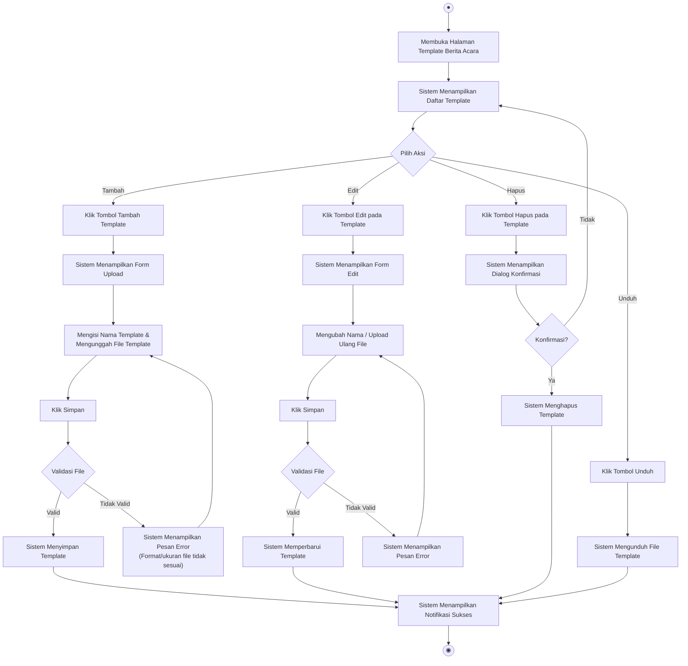
```mermaid
flowchart TD
    A(("●")) --> B["Membuka Halaman Template Berita Acara"]
    B --> C["Sistem Menampilkan Daftar Template"]
    C --> D{"Pilih Aksi"}

    D -->|Tambah| E["Klik Tombol Tambah Template"]
    E --> F["Sistem Menampilkan Form Upload"]
    F --> G["Mengisi Nama Template &\nMengunggah File Template"]
    G --> H["Klik Simpan"]
    H --> I{"Validasi File"}
    I -->|Valid| J["Sistem Menyimpan Template"]
    J --> K["Sistem Menampilkan Notifikasi Sukses"]
    I -->|Tidak Valid| L["Sistem Menampilkan Pesan Error\n(Format/ukuran file tidak sesuai)"]
    L --> G

    D -->|Edit| M["Klik Tombol Edit pada Template"]
    M --> N["Sistem Menampilkan Form Edit"]
    N --> O["Mengubah Nama / Upload Ulang File"]
    O --> P["Klik Simpan"]
    P --> Q{"Validasi File"}
    Q -->|Valid| R["Sistem Memperbarui Template"]
    R --> K
    Q -->|Tidak Valid| S["Sistem Menampilkan Pesan Error"]
    S --> O

    D -->|Hapus| T["Klik Tombol Hapus pada Template"]
    T --> U["Sistem Menampilkan Dialog Konfirmasi"]
    U --> V{"Konfirmasi?"}
    V -->|Ya| W["Sistem Menghapus Template"]
    W --> K
    V -->|Tidak| C

    D -->|Unduh| X["Klik Tombol Unduh"]
    X --> Y["Sistem Mengunduh File Template"]
    Y --> K

    K --> Z(("◉"))
```

---

### 5. Mengelola Mata Kuliah

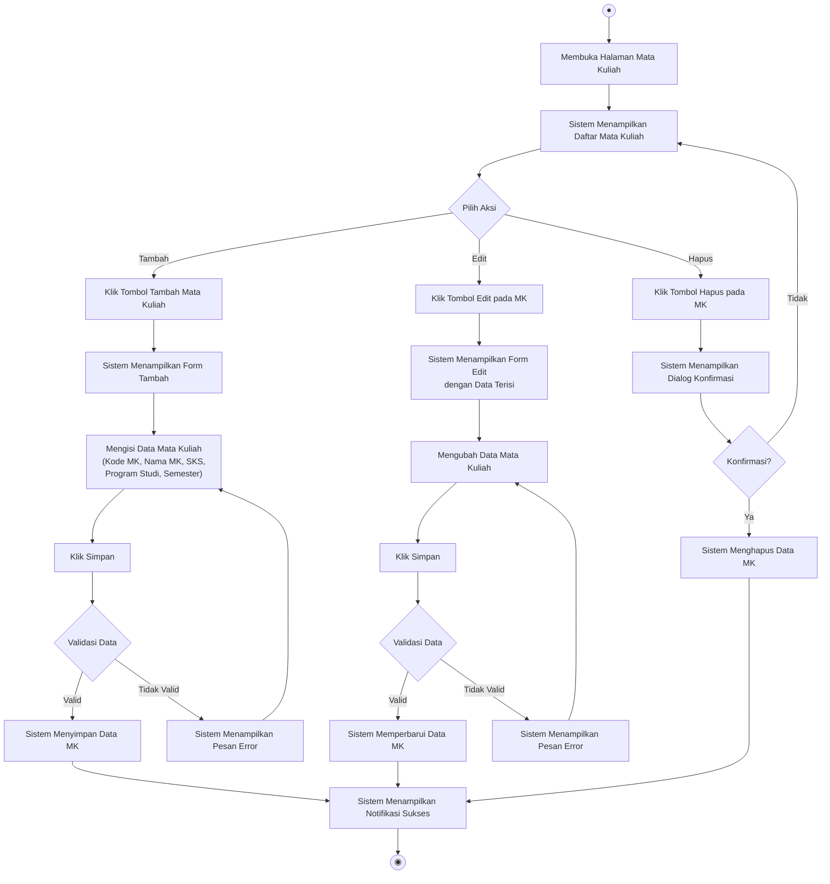
```mermaid
flowchart TD
    A(("●")) --> B["Membuka Halaman Mata Kuliah"]
    B --> C["Sistem Menampilkan Daftar Mata Kuliah"]
    C --> D{"Pilih Aksi"}

    D -->|Tambah| E["Klik Tombol Tambah Mata Kuliah"]
    E --> F["Sistem Menampilkan Form Tambah"]
    F --> G["Mengisi Data Mata Kuliah\n(Kode MK, Nama MK, SKS,\nProgram Studi, Semester)"]
    G --> H["Klik Simpan"]
    H --> I{"Validasi Data"}
    I -->|Valid| J["Sistem Menyimpan Data MK"]
    J --> K["Sistem Menampilkan Notifikasi Sukses"]
    I -->|Tidak Valid| L["Sistem Menampilkan Pesan Error"]
    L --> G

    D -->|Edit| M["Klik Tombol Edit pada MK"]
    M --> N["Sistem Menampilkan Form Edit\ndengan Data Terisi"]
    N --> O["Mengubah Data Mata Kuliah"]
    O --> P["Klik Simpan"]
    P --> Q{"Validasi Data"}
    Q -->|Valid| R["Sistem Memperbarui Data MK"]
    R --> K
    Q -->|Tidak Valid| S["Sistem Menampilkan Pesan Error"]
    S --> O

    D -->|Hapus| T["Klik Tombol Hapus pada MK"]
    T --> U["Sistem Menampilkan Dialog Konfirmasi"]
    U --> V{"Konfirmasi?"}
    V -->|Ya| W["Sistem Menghapus Data MK"]
    W --> K
    V -->|Tidak| C

    K --> Z(("◉"))
```

---

### 6. Mengelola CLO

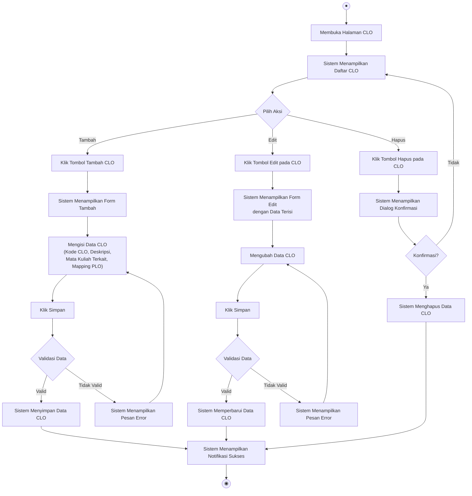
```mermaid
flowchart TD
    A(("●")) --> B["Membuka Halaman CLO"]
    B --> C["Sistem Menampilkan Daftar CLO"]
    C --> D{"Pilih Aksi"}

    D -->|Tambah| E["Klik Tombol Tambah CLO"]
    E --> F["Sistem Menampilkan Form Tambah"]
    F --> G["Mengisi Data CLO\n(Kode CLO, Deskripsi,\nMata Kuliah Terkait, Mapping PLO)"]
    G --> H["Klik Simpan"]
    H --> I{"Validasi Data"}
    I -->|Valid| J["Sistem Menyimpan Data CLO"]
    J --> K["Sistem Menampilkan Notifikasi Sukses"]
    I -->|Tidak Valid| L["Sistem Menampilkan Pesan Error"]
    L --> G

    D -->|Edit| M["Klik Tombol Edit pada CLO"]
    M --> N["Sistem Menampilkan Form Edit\ndengan Data Terisi"]
    N --> O["Mengubah Data CLO"]
    O --> P["Klik Simpan"]
    P --> Q{"Validasi Data"}
    Q -->|Valid| R["Sistem Memperbarui Data CLO"]
    R --> K
    Q -->|Tidak Valid| S["Sistem Menampilkan Pesan Error"]
    S --> O

    D -->|Hapus| T["Klik Tombol Hapus pada CLO"]
    T --> U["Sistem Menampilkan Dialog Konfirmasi"]
    U --> V{"Konfirmasi?"}
    V -->|Ya| W["Sistem Menghapus Data CLO"]
    W --> K
    V -->|Tidak| C

    K --> Z(("◉"))
```

---

### 7. Mengelola PLO

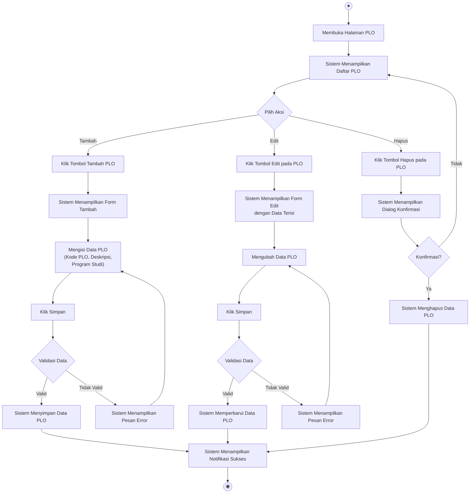
```mermaid
flowchart TD
    A(("●")) --> B["Membuka Halaman PLO"]
    B --> C["Sistem Menampilkan Daftar PLO"]
    C --> D{"Pilih Aksi"}

    D -->|Tambah| E["Klik Tombol Tambah PLO"]
    E --> F["Sistem Menampilkan Form Tambah"]
    F --> G["Mengisi Data PLO\n(Kode PLO, Deskripsi,\nProgram Studi)"]
    G --> H["Klik Simpan"]
    H --> I{"Validasi Data"}
    I -->|Valid| J["Sistem Menyimpan Data PLO"]
    J --> K["Sistem Menampilkan Notifikasi Sukses"]
    I -->|Tidak Valid| L["Sistem Menampilkan Pesan Error"]
    L --> G

    D -->|Edit| M["Klik Tombol Edit pada PLO"]
    M --> N["Sistem Menampilkan Form Edit\ndengan Data Terisi"]
    N --> O["Mengubah Data PLO"]
    O --> P["Klik Simpan"]
    P --> Q{"Validasi Data"}
    Q -->|Valid| R["Sistem Memperbarui Data PLO"]
    R --> K
    Q -->|Tidak Valid| S["Sistem Menampilkan Pesan Error"]
    S --> O

    D -->|Hapus| T["Klik Tombol Hapus pada PLO"]
    T --> U["Sistem Menampilkan Dialog Konfirmasi"]
    U --> V{"Konfirmasi?"}
    V -->|Ya| W["Sistem Menghapus Data PLO"]
    W --> K
    V -->|Tidak| C

    K --> Z(("◉"))
```

---

### 8. Mengelola Kategori Soal

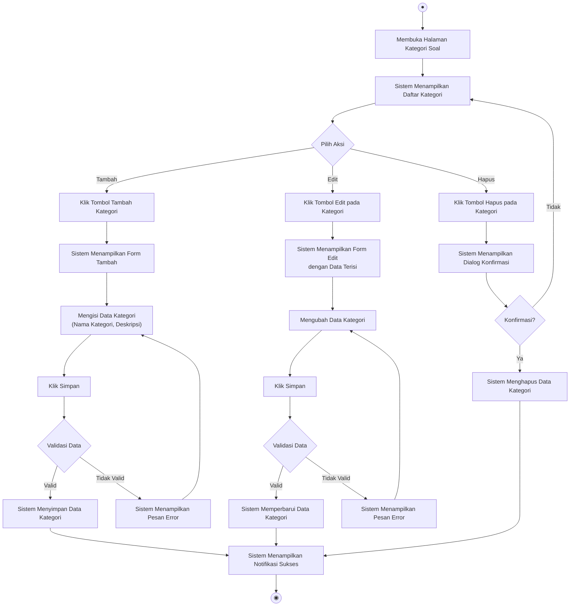
```mermaid
flowchart TD
    A(("●")) --> B["Membuka Halaman Kategori Soal"]
    B --> C["Sistem Menampilkan Daftar Kategori"]
    C --> D{"Pilih Aksi"}

    D -->|Tambah| E["Klik Tombol Tambah Kategori"]
    E --> F["Sistem Menampilkan Form Tambah"]
    F --> G["Mengisi Data Kategori\n(Nama Kategori, Deskripsi)"]
    G --> H["Klik Simpan"]
    H --> I{"Validasi Data"}
    I -->|Valid| J["Sistem Menyimpan Data Kategori"]
    J --> K["Sistem Menampilkan Notifikasi Sukses"]
    I -->|Tidak Valid| L["Sistem Menampilkan Pesan Error"]
    L --> G

    D -->|Edit| M["Klik Tombol Edit pada Kategori"]
    M --> N["Sistem Menampilkan Form Edit\ndengan Data Terisi"]
    N --> O["Mengubah Data Kategori"]
    O --> P["Klik Simpan"]
    P --> Q{"Validasi Data"}
    Q -->|Valid| R["Sistem Memperbarui Data Kategori"]
    R --> K
    Q -->|Tidak Valid| S["Sistem Menampilkan Pesan Error"]
    S --> O

    D -->|Hapus| T["Klik Tombol Hapus pada Kategori"]
    T --> U["Sistem Menampilkan Dialog Konfirmasi"]
    U --> V{"Konfirmasi?"}
    V -->|Ya| W["Sistem Menghapus Data Kategori"]
    W --> K
    V -->|Tidak| C

    K --> Z(("◉"))
```

---

### 9. Mengelola Template Soal

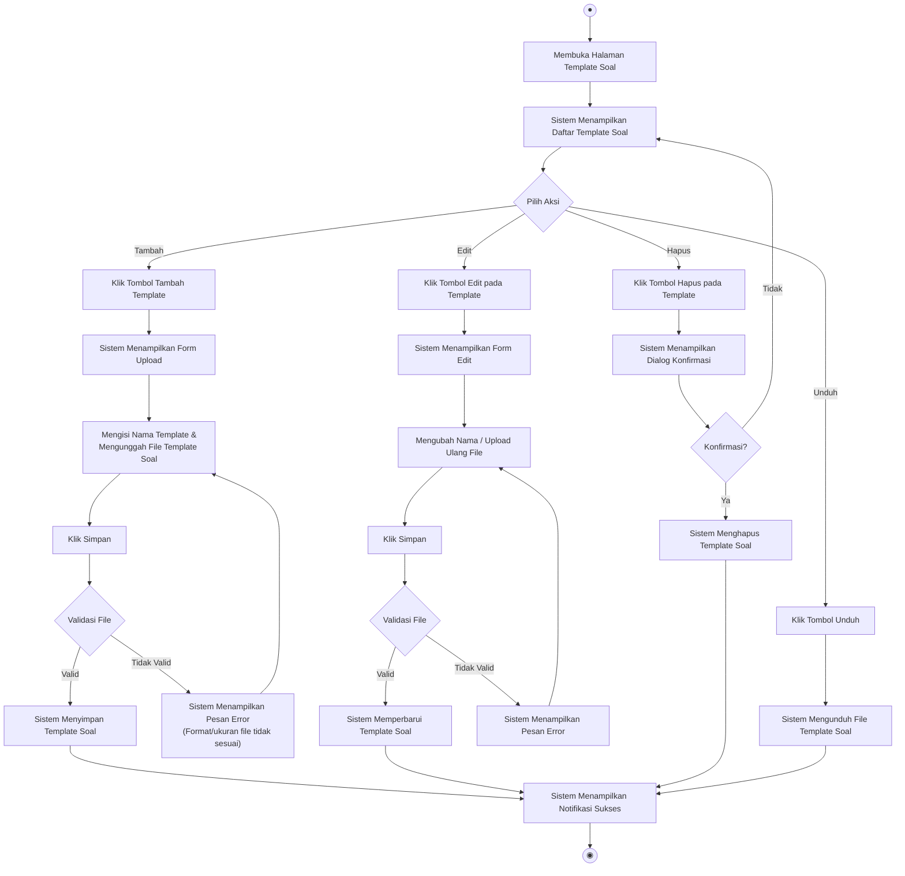
```mermaid
flowchart TD
    A(("●")) --> B["Membuka Halaman Template Soal"]
    B --> C["Sistem Menampilkan Daftar Template Soal"]
    C --> D{"Pilih Aksi"}

    D -->|Tambah| E["Klik Tombol Tambah Template"]
    E --> F["Sistem Menampilkan Form Upload"]
    F --> G["Mengisi Nama Template &\nMengunggah File Template Soal"]
    G --> H["Klik Simpan"]
    H --> I{"Validasi File"}
    I -->|Valid| J["Sistem Menyimpan Template Soal"]
    J --> K["Sistem Menampilkan Notifikasi Sukses"]
    I -->|Tidak Valid| L["Sistem Menampilkan Pesan Error\n(Format/ukuran file tidak sesuai)"]
    L --> G

    D -->|Edit| M["Klik Tombol Edit pada Template"]
    M --> N["Sistem Menampilkan Form Edit"]
    N --> O["Mengubah Nama / Upload Ulang File"]
    O --> P["Klik Simpan"]
    P --> Q{"Validasi File"}
    Q -->|Valid| R["Sistem Memperbarui Template Soal"]
    R --> K
    Q -->|Tidak Valid| S["Sistem Menampilkan Pesan Error"]
    S --> O

    D -->|Hapus| T["Klik Tombol Hapus pada Template"]
    T --> U["Sistem Menampilkan Dialog Konfirmasi"]
    U --> V{"Konfirmasi?"}
    V -->|Ya| W["Sistem Menghapus Template Soal"]
    W --> K
    V -->|Tidak| C

    D -->|Unduh| X["Klik Tombol Unduh"]
    X --> Y["Sistem Mengunduh File Template Soal"]
    Y --> K

    K --> Z(("◉"))
```

---

### 10. Mengelola Berita Acara

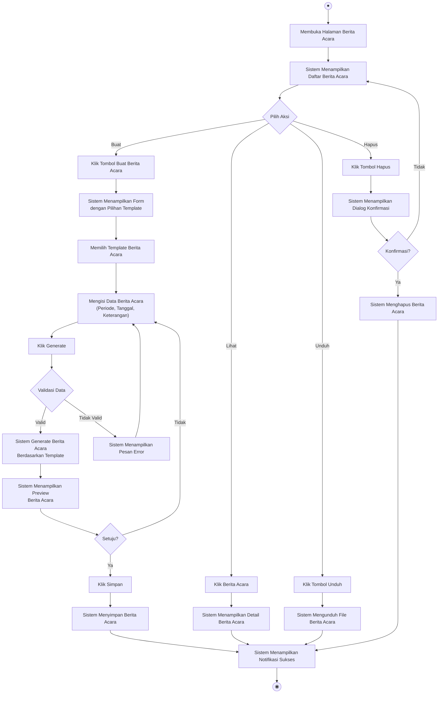
```mermaid
flowchart TD
    A(("●")) --> B["Membuka Halaman Berita Acara"]
    B --> C["Sistem Menampilkan Daftar Berita Acara"]
    C --> D{"Pilih Aksi"}

    D -->|Buat| E["Klik Tombol Buat Berita Acara"]
    E --> F["Sistem Menampilkan Form\ndengan Pilihan Template"]
    F --> G["Memilih Template Berita Acara"]
    G --> H["Mengisi Data Berita Acara\n(Periode, Tanggal, Keterangan)"]
    H --> I["Klik Generate"]
    I --> J{"Validasi Data"}
    J -->|Valid| K["Sistem Generate Berita Acara\nBerdasarkan Template"]
    K --> L["Sistem Menampilkan Preview\nBerita Acara"]
    L --> M{"Setuju?"}
    M -->|Ya| N["Klik Simpan"]
    N --> O["Sistem Menyimpan Berita Acara"]
    O --> P["Sistem Menampilkan Notifikasi Sukses"]
    M -->|Tidak| H
    J -->|Tidak Valid| Q["Sistem Menampilkan Pesan Error"]
    Q --> H

    D -->|Lihat| R["Klik Berita Acara"]
    R --> S["Sistem Menampilkan Detail Berita Acara"]
    S --> P

    D -->|Unduh| T["Klik Tombol Unduh"]
    T --> U["Sistem Mengunduh File Berita Acara"]
    U --> P

    D -->|Hapus| V2["Klik Tombol Hapus"]
    V2 --> W["Sistem Menampilkan Dialog Konfirmasi"]
    W --> X{"Konfirmasi?"}
    X -->|Ya| Y["Sistem Menghapus Berita Acara"]
    Y --> P
    X -->|Tidak| C

    P --> Z(("◉"))
```

---

## Aktor: Coordinator

### 11. Mengirim Broadcast

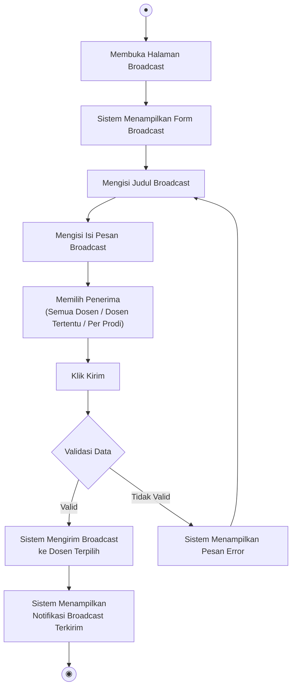
```mermaid
flowchart TD
    A(("●")) --> B["Membuka Halaman Broadcast"]
    B --> C["Sistem Menampilkan Form Broadcast"]
    C --> D["Mengisi Judul Broadcast"]
    D --> E["Mengisi Isi Pesan Broadcast"]
    E --> F["Memilih Penerima\n(Semua Dosen / Dosen Tertentu / Per Prodi)"]
    F --> G["Klik Kirim"]
    G --> H{"Validasi Data"}
    H -->|Valid| I["Sistem Mengirim Broadcast\nke Dosen Terpilih"]
    I --> J["Sistem Menampilkan\nNotifikasi Broadcast Terkirim"]
    H -->|Tidak Valid| K["Sistem Menampilkan Pesan Error"]
    K --> D

    J --> Z(("◉"))
```

---

### 12. Mengunduh Berita Acara

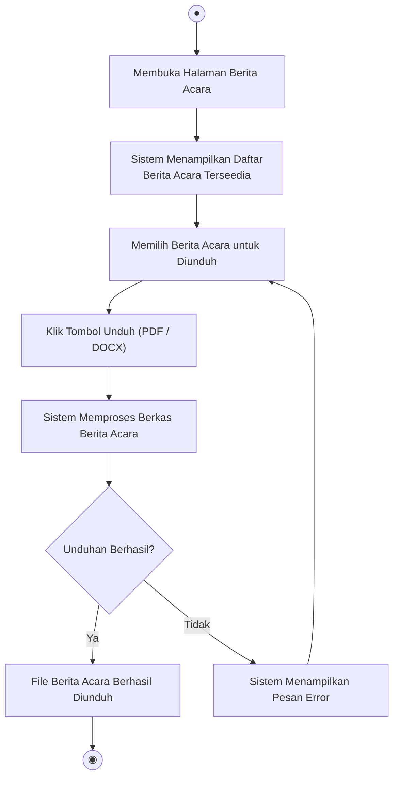
```mermaid
flowchart TD
    A(("●")) --> B["Membuka Halaman Berita Acara"]
    B --> C["Sistem Menampilkan Daftar\nBerita Acara Terseedia"]
    C --> D["Memilih Berita Acara untuk Diunduh"]
    D --> E["Klik Tombol Unduh (PDF / DOCX)"]
    E --> F["Sistem Memproses Berkas Berita Acara"]
    F --> G{"Unduhan Berhasil?"}
    G -->|Ya| H["File Berita Acara Berhasil Diunduh"]
    G -->|Tidak| I["Sistem Menampilkan Pesan Error"]
    I --> D

    H --> Z(("◉"))
```

---

### 13. Menetapkan PIC

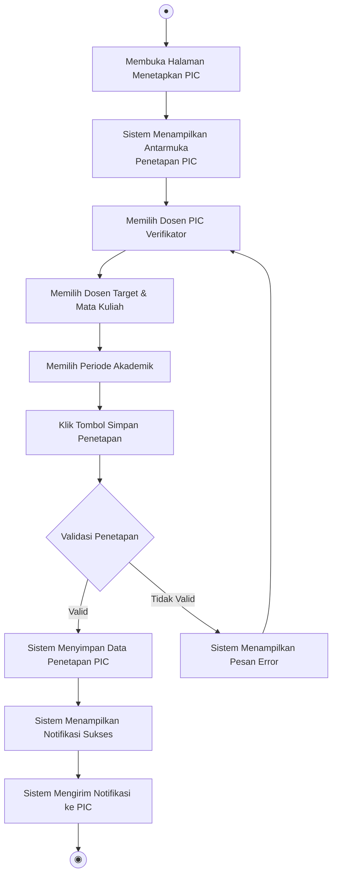
```mermaid
flowchart TD
    A(("●")) --> B["Membuka Halaman Menetapkan PIC"]
    B --> C["Sistem Menampilkan Antarmuka\nPenetapan PIC"]
    C --> D["Memilih Dosen PIC Verifikator"]
    D --> E["Memilih Dosen Target & Mata Kuliah"]
    E --> F["Memilih Periode Akademik"]
    F --> G["Klik Tombol Simpan Penetapan"]
    G --> H{"Validasi Penetapan"}
    H -->|Valid| I["Sistem Menyimpan Data Penetapan PIC"]
    I --> J["Sistem Menampilkan Notifikasi Sukses"]
    J --> K["Sistem Mengirim Notifikasi ke PIC"]
    H -->|Tidak Valid| L["Sistem Menampilkan Pesan Error"]
    L --> D

    K --> Z(("◉"))
```

---

## Aktor: PIC

### 14. Mengelola Penugasan Dosen

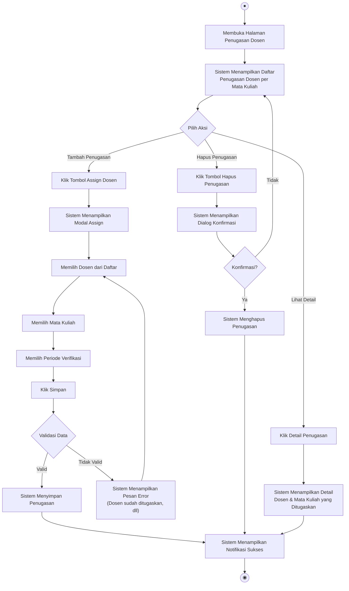
```mermaid
flowchart TD
    A(("●")) --> B["Membuka Halaman Penugasan Dosen"]
    B --> C["Sistem Menampilkan Daftar\nPenugasan Dosen per Mata Kuliah"]
    C --> D{"Pilih Aksi"}

    D -->|Tambah Penugasan| E["Klik Tombol Assign Dosen"]
    E --> F["Sistem Menampilkan Modal Assign"]
    F --> G["Memilih Dosen dari Daftar"]
    G --> H["Memilih Mata Kuliah"]
    H --> I["Memilih Periode Verifikasi"]
    I --> J["Klik Simpan"]
    J --> K{"Validasi Data"}
    K -->|Valid| L["Sistem Menyimpan Penugasan"]
    L --> M["Sistem Menampilkan Notifikasi Sukses"]
    K -->|Tidak Valid| N["Sistem Menampilkan Pesan Error\n(Dosen sudah ditugaskan, dll)"]
    N --> G

    D -->|Hapus Penugasan| O["Klik Tombol Hapus Penugasan"]
    O --> P["Sistem Menampilkan Dialog Konfirmasi"]
    P --> Q{"Konfirmasi?"}
    Q -->|Ya| R["Sistem Menghapus Penugasan"]
    R --> M
    Q -->|Tidak| C

    D -->|Lihat Detail| S["Klik Detail Penugasan"]
    S --> T["Sistem Menampilkan Detail\nDosen & Mata Kuliah yang Ditugaskan"]
    T --> M

    M --> Z(("◉"))
```

---

### 15. Memverifikasi Soal (+ Extend: Memberikan Catatan Revisi)

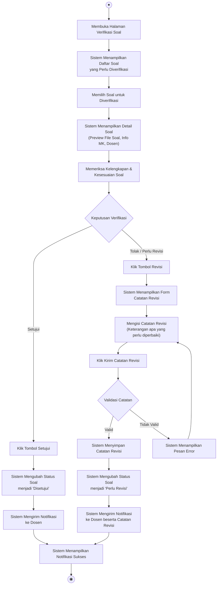
```mermaid
flowchart TD
    A(("●")) --> B["Membuka Halaman Verifikasi Soal"]
    B --> C["Sistem Menampilkan Daftar Soal\nyang Perlu Diverifikasi"]
    C --> D["Memilih Soal untuk Diverifikasi"]
    D --> E["Sistem Menampilkan Detail Soal\n(Preview File Soal, Info MK, Dosen)"]
    E --> F["Memeriksa Kelengkapan &\nKesesuaian Soal"]
    F --> G{"Keputusan Verifikasi"}

    G -->|Setujui| H["Klik Tombol Setujui"]
    H --> I["Sistem Mengubah Status Soal\nmenjadi 'Disetujui'"]
    I --> J["Sistem Mengirim Notifikasi\nke Dosen"]
    J --> K["Sistem Menampilkan Notifikasi Sukses"]

    G -->|Tolak / Perlu Revisi| L["Klik Tombol Revisi"]
    L --> M["Sistem Menampilkan Form\nCatatan Revisi"]
    M --> N["Mengisi Catatan Revisi\n(Keterangan apa yang perlu diperbaiki)"]
    N --> O["Klik Kirim Catatan Revisi"]
    O --> P{"Validasi Catatan"}
    P -->|Valid| Q["Sistem Menyimpan Catatan Revisi"]
    Q --> R["Sistem Mengubah Status Soal\nmenjadi 'Perlu Revisi'"]
    R --> S["Sistem Mengirim Notifikasi\nke Dosen beserta Catatan Revisi"]
    S --> K
    P -->|Tidak Valid| T["Sistem Menampilkan Pesan Error"]
    T --> N

    K --> Z(("◉"))
```

> [!NOTE]
> Use case **Memberikan Catatan Revisi** merupakan `<<Extend>>` dari **Memverifikasi Soal** — hanya terjadi ketika PIC memilih untuk menolak/meminta revisi soal.

---

## Aktor: Dosen

### 16. Mengunduh Template Soal

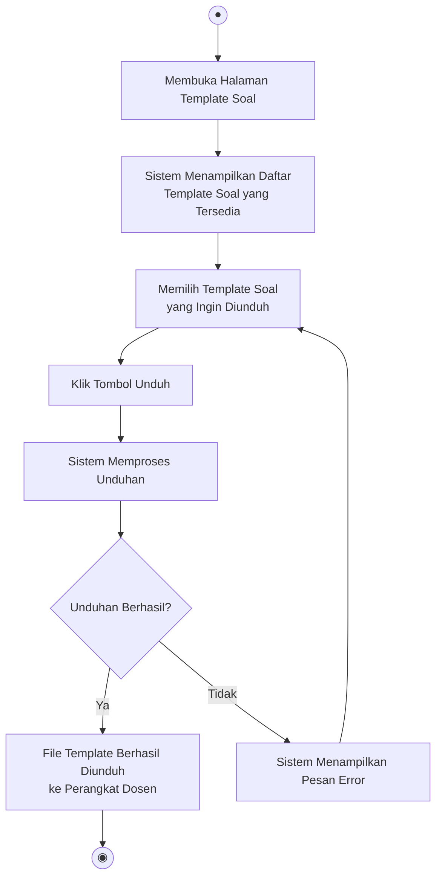
```mermaid
flowchart TD
    A(("●")) --> B["Membuka Halaman Template Soal"]
    B --> C["Sistem Menampilkan Daftar\nTemplate Soal yang Tersedia"]
    C --> D["Memilih Template Soal\nyang Ingin Diunduh"]
    D --> E["Klik Tombol Unduh"]
    E --> F["Sistem Memproses Unduhan"]
    F --> G{"Unduhan Berhasil?"}
    G -->|Ya| H["File Template Berhasil Diunduh\nke Perangkat Dosen"]
    G -->|Tidak| I["Sistem Menampilkan Pesan Error"]
    I --> D

    H --> Z(("◉"))
```

---

### 17. Melihat Broadcast

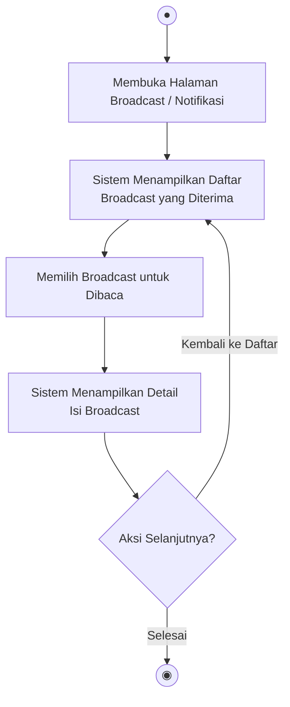
```mermaid
flowchart TD
    A(("●")) --> B["Membuka Halaman Broadcast / Notifikasi"]
    B --> C["Sistem Menampilkan Daftar\nBroadcast yang Diterima"]
    C --> D["Memilih Broadcast untuk Dibaca"]
    D --> E["Sistem Menampilkan Detail\nIsi Broadcast"]
    E --> F{"Aksi Selanjutnya?"}
    F -->|Kembali ke Daftar| C
    F -->|Selesai| G(("◉"))
```

---

### 18. Mengunggah Soal (+ Extend: Mengunggah Revisi Soal)

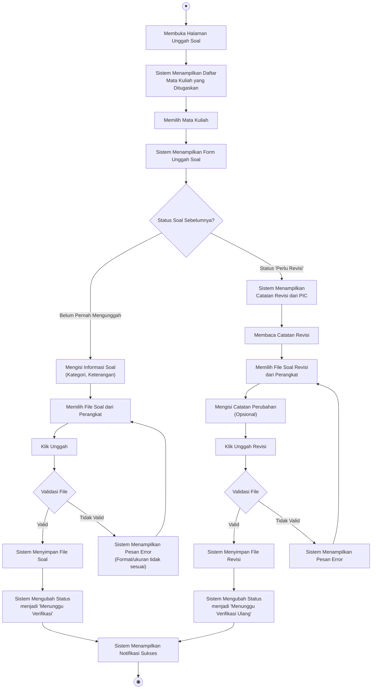
```mermaid
flowchart TD
    A(("●")) --> B["Membuka Halaman Unggah Soal"]
    B --> C["Sistem Menampilkan Daftar\nMata Kuliah yang Ditugaskan"]
    C --> D["Memilih Mata Kuliah"]
    D --> E["Sistem Menampilkan Form Unggah Soal"]
    E --> F{"Status Soal Sebelumnya?"}

    F -->|Belum Pernah Mengunggah| G["Mengisi Informasi Soal\n(Kategori, Keterangan)"]
    G --> H["Memilih File Soal dari Perangkat"]
    H --> I["Klik Unggah"]
    I --> J{"Validasi File"}
    J -->|Valid| K["Sistem Menyimpan File Soal"]
    K --> L["Sistem Mengubah Status\nmenjadi 'Menunggu Verifikasi'"]
    L --> M["Sistem Menampilkan Notifikasi Sukses"]
    J -->|Tidak Valid| N["Sistem Menampilkan Pesan Error\n(Format/ukuran tidak sesuai)"]
    N --> H

    F -->|Status 'Perlu Revisi'| O["Sistem Menampilkan\nCatatan Revisi dari PIC"]
    O --> P["Membaca Catatan Revisi"]
    P --> Q["Memilih File Soal Revisi\ndari Perangkat"]
    Q --> R["Mengisi Catatan Perubahan\n(Opsional)"]
    R --> S["Klik Unggah Revisi"]
    S --> T{"Validasi File"}
    T -->|Valid| U["Sistem Menyimpan File Revisi"]
    U --> V["Sistem Mengubah Status\nmenjadi 'Menunggu Verifikasi Ulang'"]
    V --> M
    T -->|Tidak Valid| W["Sistem Menampilkan Pesan Error"]
    W --> Q

    M --> Z(("◉"))
```

> [!NOTE]
> Use case **Mengunggah Revisi Soal** merupakan `<<Extend>>` dari **Mengunggah Soal** — hanya terjadi ketika status soal sebelumnya adalah "Perlu Revisi".

---

### 19. Melihat Status Verifikasi (+ Extend: Melihat Timeline Verifikasi & Melihat Catatan Revisi)

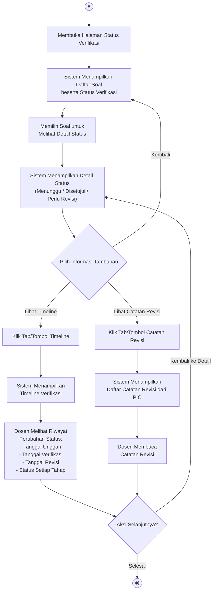
```mermaid
flowchart TD
    A(("●")) --> B["Membuka Halaman Status Verifikasi"]
    B --> C["Sistem Menampilkan Daftar Soal\nbeserta Status Verifikasi"]
    C --> D["Memilih Soal untuk\nMelihat Detail Status"]
    D --> E["Sistem Menampilkan Detail Status\n(Menunggu / Disetujui / Perlu Revisi)"]
    E --> F{"Pilih Informasi Tambahan"}

    F -->|Lihat Timeline| G["Klik Tab/Tombol Timeline"]
    G --> H["Sistem Menampilkan\nTimeline Verifikasi"]
    H --> I["Dosen Melihat Riwayat\nPerubahan Status:\n- Tanggal Unggah\n- Tanggal Verifikasi\n- Tanggal Revisi\n- Status Setiap Tahap"]
    I --> J{"Aksi Selanjutnya?"}

    F -->|Lihat Catatan Revisi| K["Klik Tab/Tombol Catatan Revisi"]
    K --> L["Sistem Menampilkan\nDaftar Catatan Revisi dari PIC"]
    L --> M["Dosen Membaca\nCatatan Revisi"]
    M --> J

    F -->|Kembali| C

    J -->|Kembali ke Detail| E
    J -->|Selesai| Z(("◉"))
```

> [!NOTE]
> Use case **Melihat Timeline Verifikasi** dan **Melihat Catatan Revisi** merupakan `<<Extend>>` dari **Melihat Status Verifikasi** — fitur tambahan yang dapat diakses saat melihat detail status.

---

## Ringkasan Mapping Use Case → Activity Diagram

| No | Use Case | Aktor | Tipe / Hubungan |
|----|----------|-------|-----------------|
| 1 | Mengelola Data Dosen | SuperAdmin | CRUD |
| 2 | Mengelola Periode Verifikasi | SuperAdmin | CRUD + Toggle |
| 3 | Mengelola Program Studi | SuperAdmin | CRUD |
| 4 | Mengelola Template Berita Acara | SuperAdmin | CRUD + Upload/Unduh |
| 5 | Mengelola Mata Kuliah | SuperAdmin | CRUD |
| 6 | Mengelola CLO | SuperAdmin | CRUD |
| 7 | Mengelola PLO | SuperAdmin | CRUD |
| 8 | Mengelola Kategori Soal | SuperAdmin | CRUD |
| 9 | Mengelola Template Soal | SuperAdmin | CRUD + Upload/Unduh |
| 10 | Mengelola Berita Acara | SuperAdmin | Generate + CRUD |
| 11 | Mengirim Broadcast | Coordinator | Send |
| 12 | Mengunduh Berita Acara | Coordinator | Download |
| 13 | Menetapkan PIC | Coordinator | Assign |
| 14 | Mengelola Penugasan Dosen | PIC | Assign/Remove |
| 15 | Memverifikasi Soal | PIC | Verify |
| 15a | Memberikan Catatan Revisi | PIC | `<<Extend>>` (Memverifikasi Soal) |
| 16 | Mengunduh Template Soal | Dosen | Download |
| 17 | Melihat Broadcast | Dosen | View |
| 18 | Mengunggah Soal | Dosen | Upload |
| 18a | Mengunggah Revisi Soal | Dosen | `<<Extend>>` (Mengunggah Soal) |
| 19 | Melihat Status Verifikasi | Dosen | View |
| 19a | Melihat Timeline Verifikasi | Dosen | `<<Extend>>` (Melihat Status Verifikasi) |
| 19b | Melihat Catatan Revisi | Dosen | `<<Extend>>` (Melihat Status Verifikasi) |
