 # Activity Diagram — Dashboard Verifikasi Soal

Dokumen ini berisi kumpulan *Activity Diagram* yang dirancang untuk menggambarkan alur kerja sistem **Dashboard Verifikasi Soal**. Seluruh diagram di bawah ini telah disesuaikan secara presisi untuk mencerminkan relasi aktor dan *use case* yang terdapat pada Use Case Diagram terbaru, serta memisahkan alur CRUD (Create, Read, Update, Delete) menjadi diagram yang mandiri untuk setiap aksi.

---

## Daftar Aktor dan Use Case

- **[SuperAdmin](#aktor-superadmin)**
  - [Mengelola Master Data](#1-mengelola-master-data-base-use-case) (Base Use Case)
    - [Mengelola Mata Kuliah](#11-mengelola-mata-kuliah-extend) (`<<Extend>>`)
      - [Melihat Daftar Mata Kuliah](#111-melihat-daftar-mata-kuliah)
    - [Mengelola CLO](#12-mengelola-clo-extend) (`<<Extend>>`)
      - [Melihat Daftar CLO](#121-melihat-daftar-clo)
      - [Menambah CLO](#122-menambah-clo)
      - [Mengubah CLO](#123-mengubah-clo)
      - [Menghapus CLO](#124-menghapus-clo)
    - [Mengelola Dosen](#13-mengelola-dosen-extend) (`<<Extend>>`)
      - [Melihat Daftar Dosen](#131-melihat-daftar-dosen)
      - [Menambah Dosen](#132-menambah-dosen)
      - [Mengubah Dosen](#133-mengubah-dosen)
      - [Menghapus Dosen](#134-menghapus-dosen)
    - [Mengelola PLO](#14-mengelola-plo-extend) (`<<Extend>>`)
      - [Melihat Daftar PLO](#141-melihat-daftar-plo)
      - [Menambah PLO](#142-menambah-plo)
      - [Mengubah PLO](#143-mengubah-plo)
      - [Menghapus PLO](#144-menghapus-plo)
  - [Mengelola Tahun Ajaran](#2-mengelola-tahun-ajaran-base-use-case) (Base Use Case)
    - [Melihat Daftar Tahun Ajaran](#21-melihat-daftar-tahun-ajaran)
    - [Menambah Tahun Ajaran](#22-menambah-tahun-ajaran)
    - [Mengubah Tahun Ajaran](#23-mengubah-tahun-ajaran)
    - [Menghapus Tahun Ajaran](#24-menghapus-tahun-ajaran)
    - [Mengubah Status Periode](#25-mengubah-status-periode-extend) (`<<Extend>>`)
  - [Mengelola Kategori Soal](#3-mengelola-kategori-soal)
    - [Melihat Daftar Kategori Soal](#31-melihat-daftar-kategori-soal)
    - [Menambah Kategori Soal](#32-menambah-kategori-soal)
    - [Mengubah Kategori Soal](#33-mengubah-kategori-soal)
    - [Menghapus Kategori Soal](#34-menghapus-kategori-soal)
  - [Menentukan Dosen Verifikator](#4-menentukan-dosen-verifikator-base-use-case) (Base Use Case)
    - [Menentukan MK](#41-menentukan-mk-include) (`<<Include>>`)

- **[Dosen Koordinator MK](#aktor-dosen-koordinator-mk)**
  - [Mengunduh Template Soal](#5-mengunduh-template-soal)
  - [Mengunggah Soal](#6-mengunggah-soal-base-use-case) (Base Use Case)
    - [Mengunggah Revisi Soal](#61-mengunggah-revisi-soal-extend) (`<<Extend>>`)
  - [Melihat Status Verifikasi](#7-melihat-status-verifikasi)

- **[Dosen Verifikator](#aktor-dosen-verifikator)**
  - [Memverifikasi Soal](#8-memverifikasi-soal-base-use-case) (Base Use Case)
    - [Memberikan Catatan Verifikasi](#81-memberikan-catatan-verifikasi-extend) (`<<Extend>>`)
    - [Mencetak Berita Acara](#82-mencetak-berita-acara-extend) (`<<Extend>>`)

---

## Aktor: SuperAdmin

### 1. Mengelola Master Data (Base Use Case)
Use case dasar untuk mengarahkan SuperAdmin ke panel pengelolaan kategori master data tertentu.

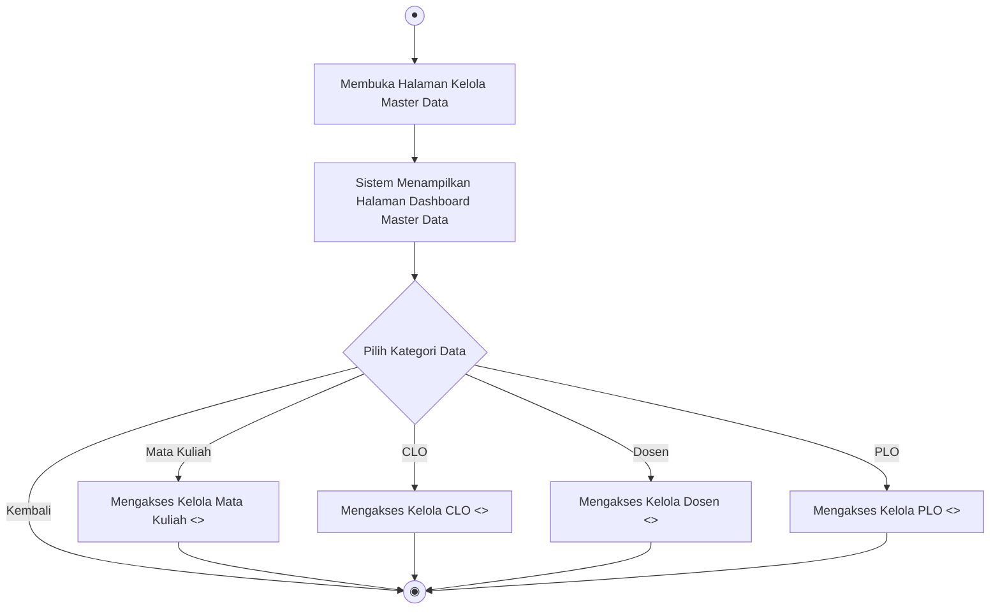

---

### 1.1 Mengelola Mata Kuliah (`<<Extend>>`)

> [!NOTE]
> Menu Mata Kuliah di website bersifat *Read-Only* (Hanya Baca). Penambahan, pengubahan, dan penghapusan data Mata Kuliah dilakukan langsung di database (melalui seeder) dan tidak disediakan di antarmuka web.

#### 1.1.1 Melihat Daftar Mata Kuliah
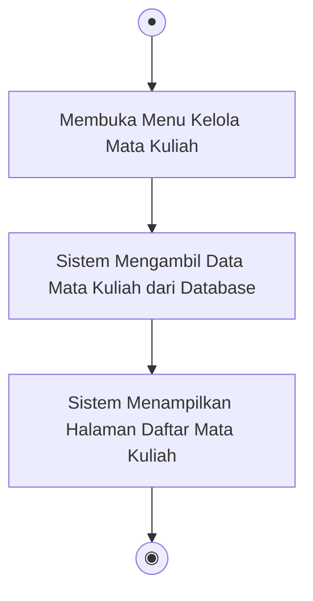

---

### 1.2 Mengelola CLO (`<<Extend>>`)

#### 1.2.1 Melihat Daftar CLO
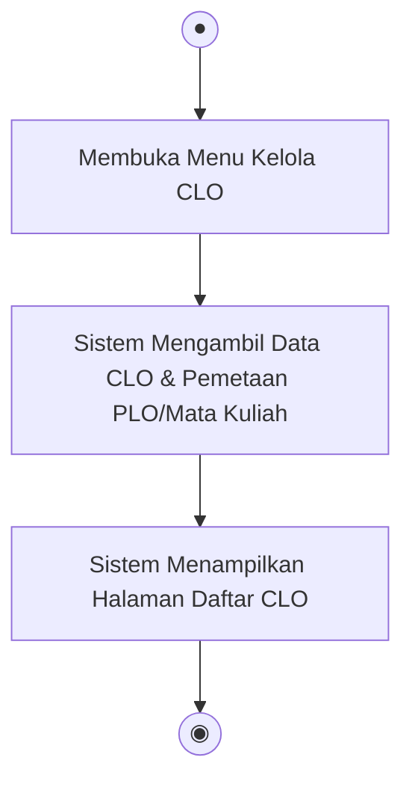

#### 1.2.2 Menambah CLO
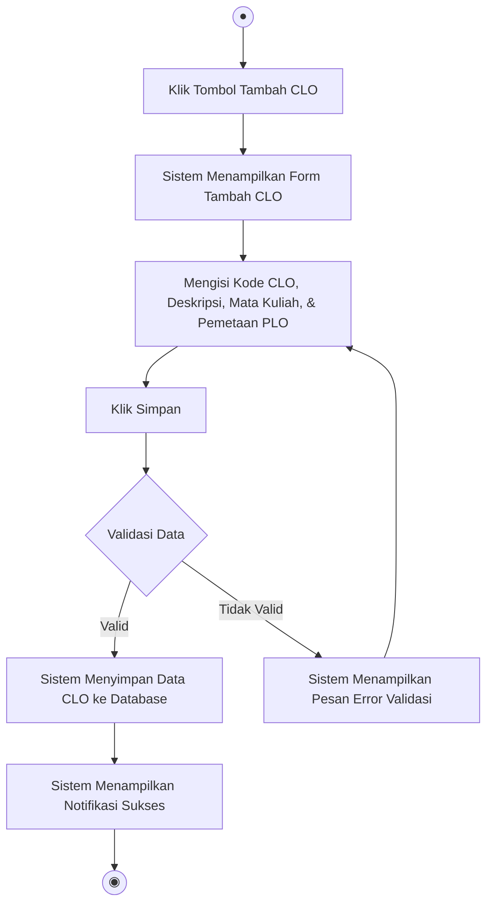

#### 1.2.3 Mengubah CLO
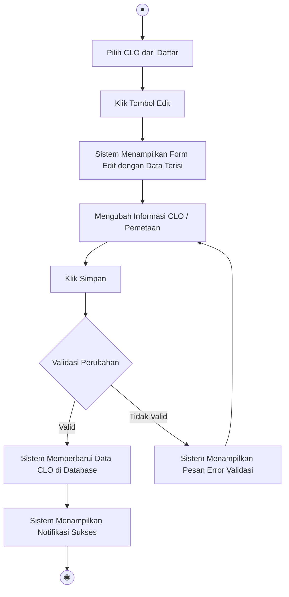

#### 1.2.4 Menghapus CLO


---

### 1.3 Mengelola Dosen (`<<Extend>>`)

#### 1.3.1 Melihat Daftar Dosen
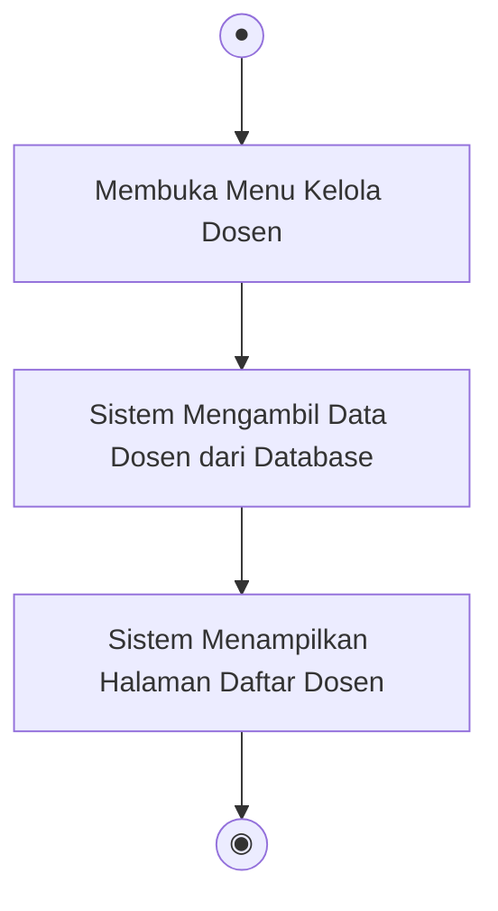

#### 1.3.2 Menambah Dosen
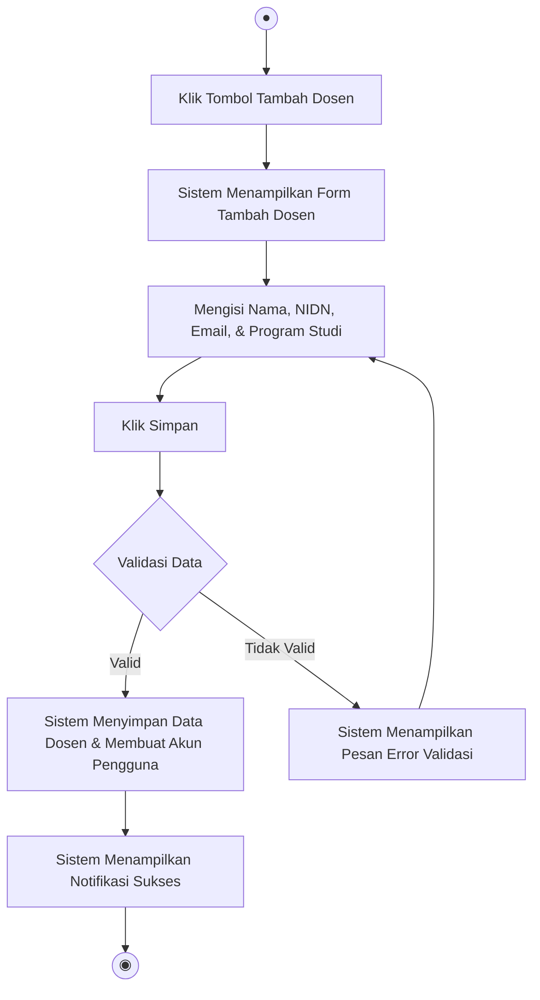

#### 1.3.3 Mengubah Dosen
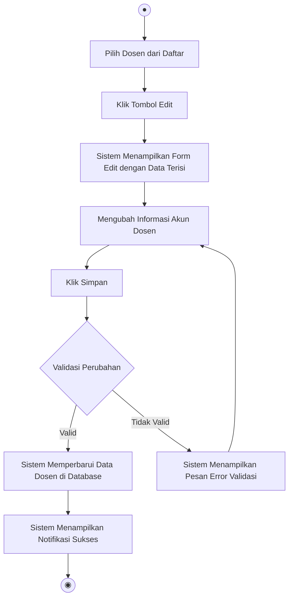

#### 1.3.4 Menghapus Dosen
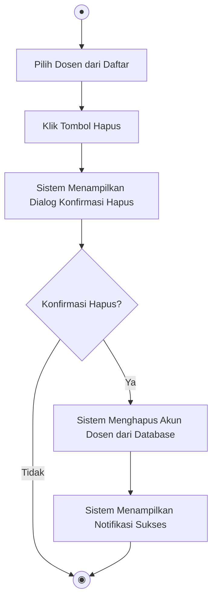

---

### 1.4 Mengelola PLO (`<<Extend>>`)

#### 1.4.1 Melihat Daftar PLO
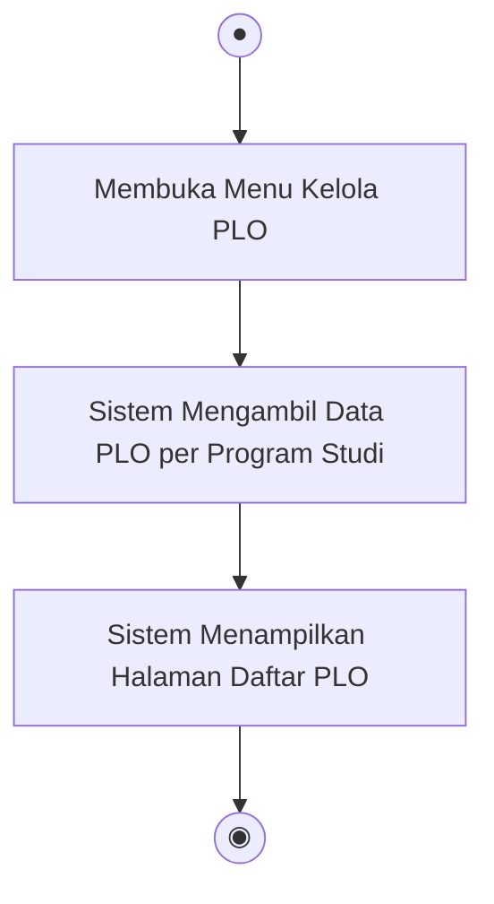

#### 1.4.2 Menambah PLO
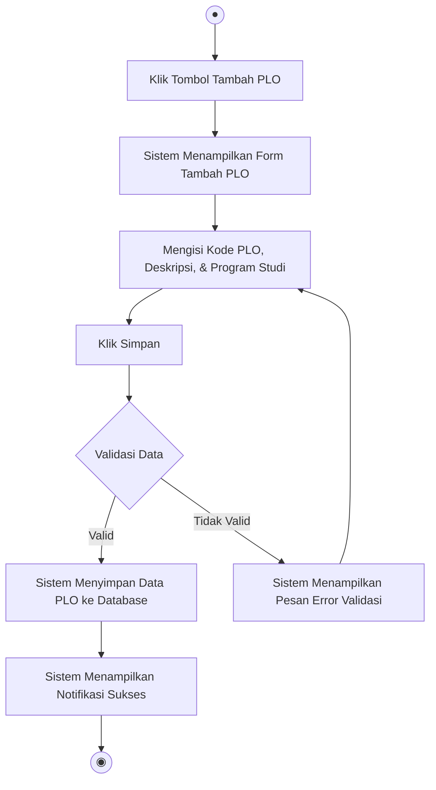

#### 1.4.3 Mengubah PLO
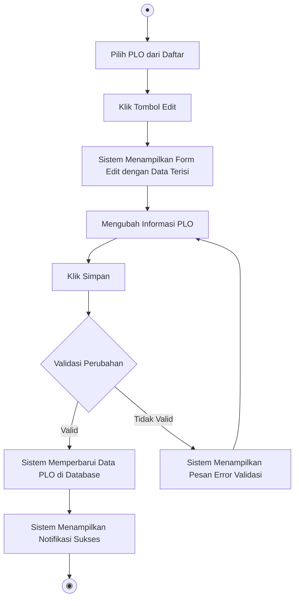

#### 1.4.4 Menghapus PLO


---

### 2. Mengelola Tahun Ajaran (Base Use Case)

#### 2.1 Melihat Daftar Tahun Ajaran
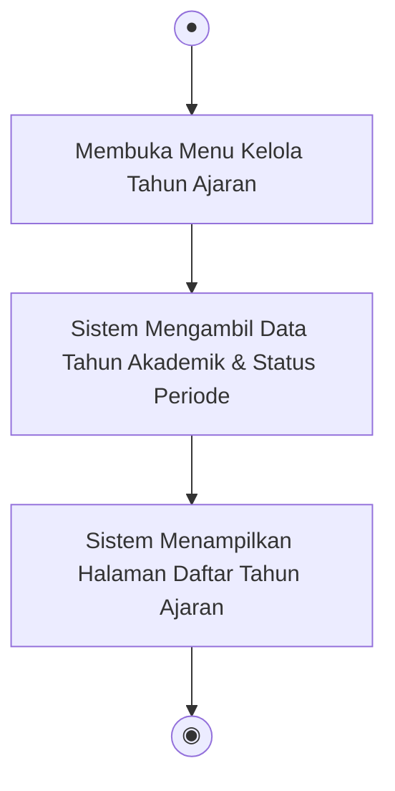

#### 2.2 Menambah Tahun Ajaran
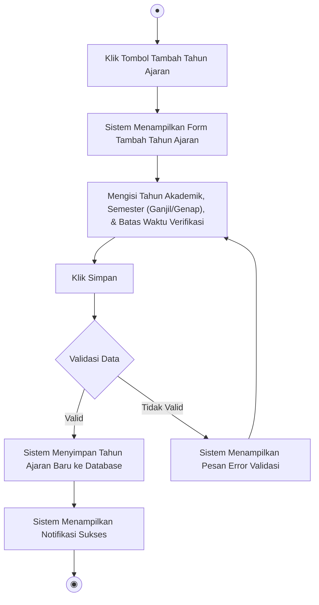

#### 2.3 Mengubah Tahun Ajaran
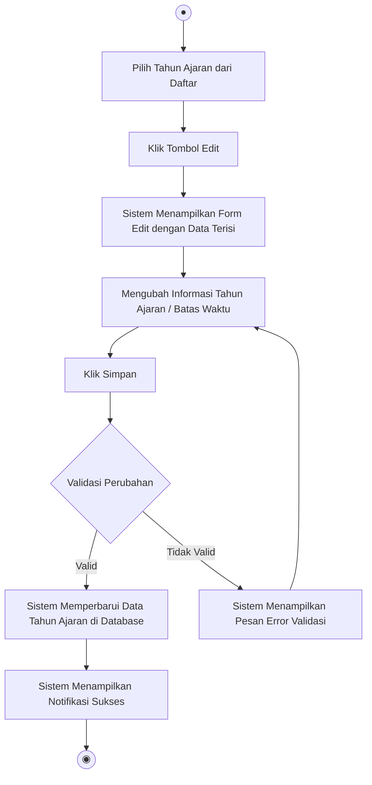

#### 2.4 Menghapus Tahun Ajaran
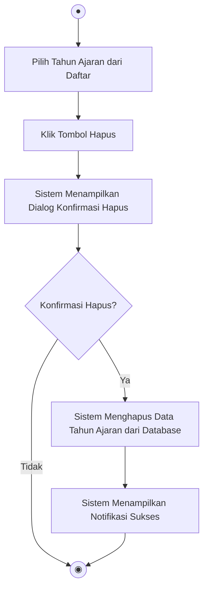

#### 2.5 Mengubah Status Periode (`<<Extend>>`)
Diaktifkan ketika SuperAdmin memilih untuk mengubah status suatu periode verifikasi. Mengimplementasikan titik perluasan (*extension point*) **Menonaktifkan Periode Verifikasi** jika periode yang dipilih diaktifkan.

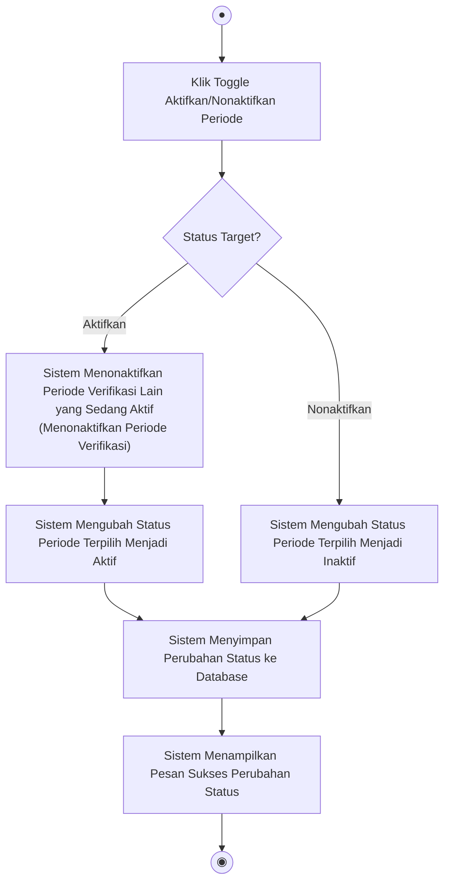

---

### 3. Mengelola Kategori Soal

#### 3.1 Melihat Daftar Kategori Soal
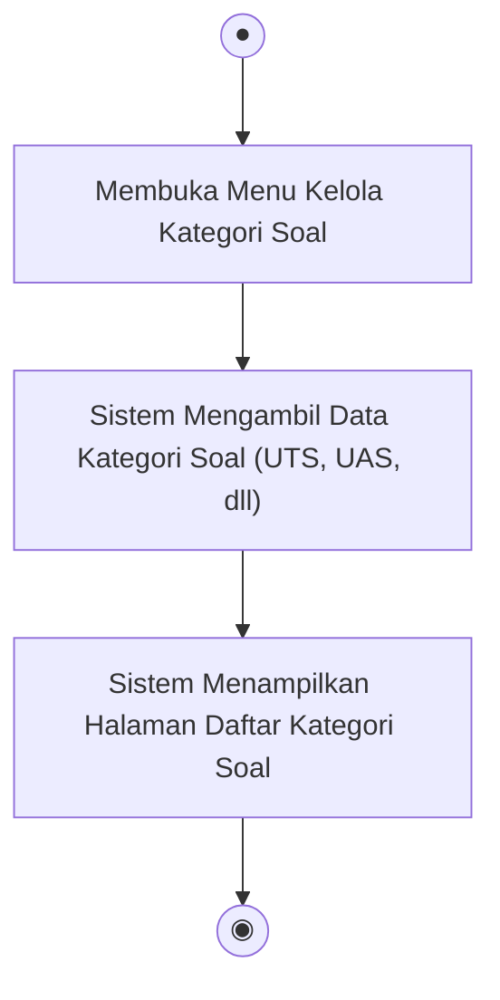

#### 3.2 Menambah Kategori Soal
```mermaid
flowchart TD
    Start(("●")) --> ClickAdd["Klik Tombol Tambah Kategori"]
    ClickAdd --> ShowForm["Sistem Menampilkan Form Tambah Kategori"]
    ShowForm --> InputData["Mengisi Nama Kategori Soal & Keterangan"]
    InputData --> ClickSave["Klik Simpan"]
    ClickSave --> Validate{"Validasi Data"}
    Validate -->|Valid| StoreData["Sistem Menyimpan Kategori Baru ke Database"]
    StoreData --> ShowSuccess["Sistem Menampilkan Notifikasi Sukses"]
    Validate -->|Tidak Valid| ShowError["Sistem Menampilkan Pesan Error Validasi"]
    ShowError --> InputData
    ShowSuccess --> End(("◉"))
```

#### 3.3 Mengubah Kategori Soal
```mermaid
flowchart TD
    Start(("●")) --> SelectKat["Pilih Kategori dari Daftar"]
    SelectKat --> ClickEdit["Klik Tombol Edit"]
    ClickEdit --> ShowForm["Sistem Menampilkan Form Edit dengan Data Terisi"]
    ShowForm --> UpdateData["Mengubah Informasi Kategori"]
    UpdateData --> ClickSave["Klik Simpan"]
    ClickSave --> Validate{"Validasi Perubahan"}
    Validate -->|Valid| UpdateDB["Sistem Memperbarui Data Kategori di Database"]
    UpdateDB --> ShowSuccess["Sistem Menampilkan Notifikasi Sukses"]
    Validate -->|Tidak Valid| ShowError["Sistem Menampilkan Pesan Error Validasi"]
    ShowError --> UpdateData
    ShowSuccess --> End(("◉"))
```

#### 3.4 Menghapus Kategori Soal
```mermaid
flowchart TD
    Start(("●")) --> SelectKat["Pilih Kategori dari Daftar"]
    SelectKat --> ClickDelete["Klik Tombol Hapus"]
    ClickDelete --> ShowConfirm["Sistem Menampilkan Dialog Konfirmasi Hapus"]
    ShowConfirm --> Confirm{"Konfirmasi Hapus?"}
    Confirm -->|Ya| DeleteDB["Sistem Menghapus Data Kategori dari Database"]
    DeleteDB --> ShowSuccess["Sistem Menampilkan Notifikasi Sukses"]
    Confirm -->|Tidak| End(("◉"))
    ShowSuccess --> End
```

---

### 4. Menentukan Dosen Verifikator (Base Use Case)
Alur penugasan Dosen sebagai Verifikator (PIC) terhadap dosen pengampu soal lainnya. Secara inheren menyertakan pemilihan mata kuliah tujuan (`<<Include>>`).

```mermaid
flowchart TD
    Start(("●")) --> OpenPanel["Membuka Halaman Penugasan Dosen Verifikator"]
    OpenPanel --> ShowList["Sistem Menampilkan Daftar Penugasan Verifikator"]
    ShowList --> ClickAssign["Klik Tambah Penugasan Dosen Verifikator"]
    ClickAssign --> SelectDosen["Memilih Dosen Verifikator dari Daftar"]
    
    %% Included Use Case
    SelectDosen --> IncMatkul["Menentukan MK <<Include>>"]
    
    IncMatkul --> SelectTargetDosen["Memilih Dosen Target (Dosen Pengampu Soal)"]
    SelectTargetDosen --> SaveAssignment["Klik Simpan Penugasan"]
    SaveAssignment --> ValidData{"Validasi Penugasan"}
    
    ValidData -->|Valid| StoreAssignment["Sistem Menyimpan Penugasan Dosen Verifikator"]
    StoreAssignment --> AlertSuccess["Sistem Menampilkan Notifikasi Sukses"]
    ValidData -->|Tidak Valid| ErrMsg["Sistem Menampilkan Error (Duplikasi Penugasan, dll)"]
    ErrMsg --> SelectDosen
    
    AlertSuccess --> End(("◉"))
```

#### 4.1 Menentukan MK (`<<Include>>`)
Langkah wajib di mana sistem meminta penentuan mata kuliah spesifik untuk penugasan tersebut.

```mermaid
flowchart TD
    Start(("●")) --> FetchCourses["Sistem Memuat Daftar Mata Kuliah"]
    FetchCourses --> SelectCourses["Memilih Satu atau Beberapa Mata Kuliah yang Ditugaskan"]
    SelectCourses --> End(("◉"))
```

---

## Aktor: Dosen Koordinator MK

### 5. Mengunduh Template Soal
Alur mengunduh template naskah soal ujian resmi yang disediakan oleh Fakultas.

```mermaid
flowchart TD
    Start(("●")) --> OpenTemplate["Membuka Halaman Template Soal"]
    OpenTemplate --> ShowTemplates["Sistem Menampilkan Daftar Template Soal Resmi"]
    ShowTemplates --> ClickDownload["Klik Tombol Unduh pada Template Terpilih"]
    ClickDownload --> ProcessDownload["Sistem Memproses Berkas Template (PDF/DOCX)"]
    ProcessDownload --> DownloadSuccess{"Unduhan Berhasil?"}
    DownloadSuccess -->|Ya| RecFile["Berkas Disimpan di Perangkat Pengguna"]
    DownloadSuccess -->|Tidak| ShowErr["Sistem Menampilkan Pesan Kegagalan"]
    ShowErr --> ShowTemplates
    
    RecFile --> End(("◉"))
```

---

### 6. Mengunggah Soal (Base Use Case)
Alur pengunggahan naskah soal baru oleh Dosen Koordinator MK yang dapat diperluas oleh fitur pengunggahan revisi (`<<Extend>>`).

```mermaid
flowchart TD
    Start(("●")) --> OpenUpload["Membuka Halaman Unggah Soal"]
    OpenUpload --> ShowCourses["Sistem Menampilkan Daftar MK yang Diampu"]
    ShowCourses --> ChooseCourse["Memilih Mata Kuliah"]
    ChooseCourse --> CheckStatus{"Status Unggahan Sebelumnya?"}
    
    %% Alur Normal (Belum Pernah Mengunggah)
    CheckStatus -->|Belum Mengunggah| InputMeta["Mengisi Detail Soal\n(Kategori Soal, Pemetaan CLO/PLO)"]
    InputMeta --> SelectFile["Memilih Berkas Soal (PDF/DOCX)"]
    SelectFile --> ClickUpload["Klik Unggah Soal"]
    ClickUpload --> ValidFile{"Validasi File"}
    ValidFile -->|Valid| StoreFile["Sistem Menyimpan Berkas Soal"]
    StoreFile --> SetStatus["Sistem Mengubah Status Soal Menjadi 'Menunggu Verifikasi'"]
    SetStatus --> AlertSuccess["Sistem Menampilkan Notifikasi Sukses"]
    ValidFile -->|Tidak Valid| ShowErr["Sistem Menampilkan Pesan Error Validasi"]
    ShowErr --> SelectFile
    
    %% Alur Extend (Status Perlu Revisi)
    CheckStatus -->|Perlu Revisi| ExtRevisi["Mengunggah Revisi Soal <<Extend>>"]
    
    AlertSuccess --> End(("◉"))
    ExtRevisi --> End
```

#### 6.1 Mengunggah Revisi Soal (`<<Extend>>`)
Dijalankan ketika berkas naskah soal berstatus "Perlu Revisi", memungkinkan pengunggahan revisi untuk memperbaiki soal berdasarkan catatan.

```mermaid
flowchart TD
    Start(("●")) --> ViewRevisionNotes["Membaca Catatan Revisi dari Dosen Verifikator"]
    ViewRevisionNotes --> SelectRevisedFile["Memilih Berkas Soal Revisi Baru (PDF/DOCX)"]
    SelectRevisedFile --> FillChangeNotes["Mengisi Catatan Perubahan/Revisi (Opsional)"]
    FillChangeNotes --> ClickUploadRevisi["Klik Unggah Revisi Soal"]
    ClickUploadRevisi --> ValidFile{"Validasi File"}
    ValidFile -->|Valid| StoreRevisedFile["Sistem Menyimpan Berkas Soal Revisi"]
    StoreRevisedFile --> UpdateStatus["Sistem Mengubah Status Soal Menjadi 'Menunggu Verifikasi Ulang'"]
    UpdateStatus --> ShowAlert["Sistem Menampilkan Notifikasi Sukses"]
    ValidFile -->|Tidak Valid| ShowErr["Sistem Menampilkan Pesan Error Validasi"]
    ShowErr --> SelectRevisedFile
    
    ShowAlert --> End(("◉"))
```

---

### 7. Melihat Status Verifikasi
Alur bagi Dosen Koordinator MK untuk memantau status persetujuan berkas soal yang telah diunggah.

```mermaid
flowchart TD
    Start(("●")) --> OpenStatus["Membuka Halaman Status Verifikasi Soal"]
    OpenStatus --> ShowStatusList["Sistem Menampilkan Daftar Soal & Status Terkini\n(Draft / Menunggu Verifikasi / Perlu Revisi / Disetujui)"]
    ShowStatusList --> SelectSoal["Memilih Soal/Mata Kuliah untuk Melihat Detail"]
    SelectSoal --> ShowDetail["Sistem Menampilkan Detail Status, Catatan Verifikator, & Riwayat Perubahan"]
    ShowDetail --> End(("◉"))
```

---

## Aktor: Dosen Verifikator

### 8. Memverifikasi Soal (Base Use Case)
Alur pemeriksaan naskah soal ujian oleh Dosen Verifikator. Jika disetujui, verifikator dapat mencetak berita acara (`<<Extend>>`). Jika tidak, verifikator wajib memberikan catatan verifikasi (`<<Extend>>`).

```mermaid
flowchart TD
    Start(("●")) --> OpenVerify["Membuka Halaman Tugas Verifikasi"]
    OpenVerify --> ShowTasks["Sistem Menampilkan Daftar Soal yang Perlu Diverifikasi"]
    ShowTasks --> SelectTask["Memilih Soal untuk Diverifikasi"]
    SelectTask --> PreviewSoal["Sistem Menampilkan Detail Soal & File Preview"]
    PreviewSoal --> ReviewSoal["Memeriksa Kesesuaian Soal dengan Template & CLO/PLO"]
    ReviewSoal --> Decision{"Keputusan Verifikasi"}
    
    %% Setujui
    Decision -->|Setujui| ClickApprove["Klik Tombol Setujui"]
    ClickApprove --> SaveApprove["Sistem Menyimpan Status 'Disetujui'"]
    SaveApprove --> NotifyDosen["Sistem Mengirim Notifikasi ke Dosen Koordinator MK"]
    NotifyDosen --> ShowSuccess["Sistem Menampilkan Notifikasi Sukses"]
    ShowSuccess --> ExtCetak["Mencetak Berita Acara <<Extend>>"]
    
    %% Perlu Revisi
    Decision -->|Minta Revisi| ExtCatatan["Memberikan Catatan Verifikasi <<Extend>>"]
    
    ExtCetak --> End(("◉"))
    ExtCatatan --> End
```

#### 8.1 Memberikan Catatan Verifikasi (`<<Extend>>`)
Dijalankan apabila Dosen Verifikator memutuskan bahwa berkas soal memerlukan perbaikan.

```mermaid
flowchart TD
    Start(("●")) --> OpenFormCatatan["Sistem Menampilkan Form Catatan Verifikasi"]
    OpenFormCatatan --> FillCatatan["Mengisi Catatan Revisi & Checklist Ketidaksesuaian"]
    FillCatatan --> ClickSubmitCatatan["Klik Kirim Catatan Verifikasi"]
    ClickSubmitCatatan --> SaveRevision["Sistem Menyimpan Catatan Verifikasi"]
    SaveRevision --> UpdateStatus["Sistem Mengubah Status Soal Menjadi 'Perlu Revisi'"]
    UpdateStatus --> NotifyDosen["Sistem Mengirim Notifikasi dan Catatan ke Dosen Koordinator MK"]
    NotifyDosen --> ShowAlert["Sistem Menampilkan Notifikasi Sukses"]
    
    ShowAlert --> End(("◉"))
```

#### 8.2 Mencetak Berita Acara (`<<Extend>>`)
Dijalankan setelah soal berstatus "Disetujui", memungkinkan pencetakan Berita Acara Verifikasi resmi.

```mermaid
flowchart TD
    Start(("●")) --> ClickPrintBA["Klik Tombol Cetak Berita Acara"]
    ClickPrintBA --> SystemGenerate["Sistem Menggenerasi File Berita Acara (PDF/DOCX) secara Otomatis"]
    SystemGenerate --> ShowDownload["Sistem Menyediakan File untuk Diunduh"]
    ShowDownload --> DownloadBA["Dosen Verifikator Mengunduh dan Mencetak Berita Acara"]
    DownloadBA --> End(("◉"))
```
