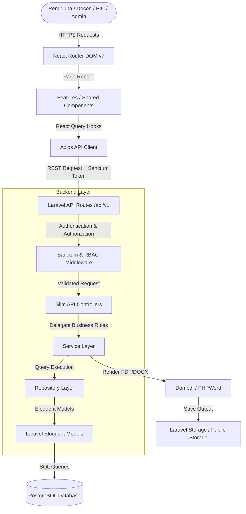

# Arsitektur Sistem (architecture.md)

# Dashboard Verifikasi Soal Ujian — Telkom University Jakarta

Dokumen ini menjelaskan arsitektur perangkat lunak, tumpukan teknologi (tech stack), pola desain (design pattern), aliran data, serta organisasi direktori pada proyek **Dashboard Verifikasi Soal Ujian**.

---

## 1. Ringkasan Teknis (Tech Stack Overview)

Aplikasi ini menggunakan arsitektur **Single Page Application (SPA)** berbasis RESTful API dengan pemisahan yang jelas antara backend service dan frontend interface.

```
+-----------------------------------------------------------------------+
|                         FRONTEND (React SPA)                          |
|  React 19 + TypeScript + Vite 8 + React Router v7 + Tailwind CSS v4   |
|     State: TanStack React Query v5 | Form: React Hook Form + Zod     |
+-----------------------------------------------------------------------+
                                   |
                         HTTP / REST API (Sanctum)
                                   |
+-----------------------------------------------------------------------+
|                        BACKEND (Laravel API)                          |
|   Laravel 12 (PHP 8.2+) | Sanctum Auth | Service-Repository Pattern |
|  Doc Gen: barryvdh/laravel-dompdf | phpoffice/phpword                |
+-----------------------------------------------------------------------+
                                   |
                              Database Driver
                                   |
+-----------------------------------------------------------------------+
|                         DATABASE ENGINE                               |
|                  PostgreSQL 14+ (UTF-8, WIB/UTC+7)                   |
|           UUID v4 + BIGINT PKs | Composite Indexes | Soft Deletes    |
+-----------------------------------------------------------------------+
```

### A. Backend Stack
- **Framework & Runtime:** PHP 8.2+ dengan Framework **Laravel 12**.
- **Autentikasi & Keamanan:** **Laravel Sanctum** (Stateful / Bearer Token Authentication).
- **ORM & Database:** **Eloquent ORM** dengan PostgreSQL 14+.
- **Document Processing Engine:** 
  - PDF Generation: `barryvdh/laravel-dompdf` (Dompdf 3.0).
  - DOCX Generation: `phpoffice/phpword` (PHPWord 1.4).
- **Logging & Debugging:** Laravel Pail & Activity Log Auditing.

### B. Frontend Stack
- **Library Utama:** **React 19** & **TypeScript 5+**.
- **Build Tool & Bundler:** **Vite 8** dengan `@vitejs/plugin-react` dan `laravel-vite-plugin`.
- **Routing:** **React Router DOM v7** (Client-Side Routing).
- **Data Fetching & State Management:** **TanStack React Query v5** (`@tanstack/react-query`) untuk caching & server state management.
- **Form Management & Validasi:** **React Hook Form** + **Zod** schema validation (`@hookform/resolvers`).
- **Styling & UI Components:** **Tailwind CSS v4** dengan CSS variables HSL (Telkom University Red `#C8102E`), **Lucide React** icons, **Sonner** toast notifications, `clsx`, dan `tailwind-merge`.
- **Media & Document Handling:** `react-pdf`, `jspdf`, `xlsx`, `react-dropzone`, `recharts` untuk visualisasi grafik statistik.

---

## 2. Diagram Arsitektur & Alur Data (System Data Flow)



---

## 3. Layered Architecture (Pola Lapisan Perangkat Lunak)

Sistem mengadopsi **Service-Repository Pattern** untuk memastikan pemisahan tanggung jawab (*Separation of Concerns*), kemudahan pengujian (*Testability*), serta keterpeliharaan kode (*Maintainability*).

### 1. Presentation Layer (Frontend - React)
- **Features Directory (`resources/js/features/`):** Setiap modul bisnis (contoh: `auth`, `soal`, `verifikasi`, `berita-acara`, `periode`) memiliki struktur mandiri yang berisi komponen, hooks, API calls, dan tipe TypeScript tersendiri.
- **Shared Directory (`resources/js/shared/`):** Menyediakan layout global (`MainLayout`), komponen UI reusabel (`PageHeader`, `StatusBadge`, `Modal`, `Pagination`, `Skeleton`), dan utility umum.

### 2. API & Middleware Layer (Backend - Laravel)
- **Routes (`routes/api.php`):** Mendefinisikan endpoint REST API bersarang yang diproteksi oleh middleware.
- **Middleware (`app/Http/Middleware/`):** Memeriksa token autentikasi Sanctum dan hak akses peran (`super_admin`, `coordinator`, `pic_periode`).
- **Form Requests (`app/Http/Requests/`):** Menangani seluruh validasi data masuk sebelum menyentuh Controller.

### 3. Controller Layer (Backend)
- **Slim Controllers (`app/Http/Controllers/Api/`):** Controller bertugas *hanya* menerima request dari Form Request, memanggil metode di Service Layer, dan mengembalikan `JsonResponse` berformat standar. Controller **TIDAK BOLEH** berisi query database langsung atau logika bisnis kompleks.

### 4. Service Layer (Backend)
- **Business Logic (`app/Services/`):** Mengkapsulasi aturan bisnis aplikasi (seperti verifikasi hak upload pada periode aktif, pencegahan self-verification, kalkulasi status soal, dan penggenerasian Berita Acara otomatis).

### 5. Repository Layer (Backend)
- **Data Access (`app/Repositories/`):** Mengabstraksi query Eloquent, penanganan eager loading (`with()`), filter pencarian, dan transaksi database.

### 6. Database Layer (PostgreSQL)
- Menyimpan data utama dengan constraint integritas (Foreign Keys, Unique Indices), UUID untuk public lookup, dan timestamps soft delete.

---

## 4. Struktur Direktori Proyek

### A. Backend Architecture (`app/`)
```
app/
├── Enums/                     # Enum untuk Status Soal, Role, Tipe Verifikator
│   ├── SoalStatusEnum.php
│   ├── UserRoleEnum.php
│   └── VerificationStatusEnum.php
├── Exceptions/                # Custom Exception Handlers & API Responses
├── Http/
│   ├── Controllers/
│   │   └── Api/               # REST API Controllers (Slim Controllers)
│   │       ├── AuthController.php
│   │       ├── SoalController.php
│   │       ├── VerifikasiController.php
│   │       ├── BeritaAcaraController.php
│   │       └── PeriodeController.php
│   ├── Middleware/            # RBAC & Sanctum Auth Middleware
│   └── Requests/              # Form Request Validation Classes
├── Jobs/                      # Background Jobs (PDF Generation, Broadcast Notification)
├── Models/                    # Eloquent Model Definitions & Relationships
├── Providers/                 # Service Providers Registration
├── Repositories/              # Data Access Layer (Eloquent Queries)
│   ├── Contracts/             # Interfaces Repository
│   ├── SoalRepository.php
│   └── VerifikasiRepository.php
└── Services/                  # Core Business Logic Layer
    ├── SoalService.php
    ├── VerifikasiService.php
    └── BeritaAcaraService.php
```

### B. Frontend Architecture (`resources/js/`)
```
resources/js/
├── app/                       # Configs, Providers, Axios Instance
│   ├── api/                   # Axios Base Client & Interceptors
│   ├── providers/             # React Query Provider, Auth Context
│   └── routes/                # Client-side Router Setup
├── features/                  # Feature Modules (Domain Driven)
│   ├── auth/                  # Login, Profile, Reset Password
│   ├── berita-acara/          # BA Generation, Preview, Template Mgmt
│   ├── dashboard/             # Statistics Widgets & Progress Charts
│   ├── master/                # Prodi, Courses, PLO/CLO Management
│   ├── periode/               # Academic Period Management
│   ├── soal/                  # Upload Soal, Revisi History, Dosen Workflow
│   └── verifikasi/            # PIC Verification Workflow & Audit Log
└── shared/                    # Reusable Shared Code
    ├── components/
    │   ├── layouts/           # MainLayout, AuthLayout, Sidebar, Topbar
    │   └── ui/                # Button, Modal, StatusBadge, Skeleton, Toast
    ├── hooks/                 # Custom Hooks (useAuth, useDebounce)
    ├── types/                 # TypeScript Global Definitions & Models
    └── utils/                 # Formatters, Helpers, Constants
```

---

## 5. Keamanan & Kontrol Akses (Security Architecture)

1. **Role-Based Access Control (RBAC):**
   - Peran Utama: `Super Admin`, `Coordinator`, `Dosen`, `PIC (Verifikator)`.
   - Seorang Dosen dapat berperan ganda sebagai `PIC Verifikator` pada `periode` tertentu melalui pemetaan di `user_roles` dan `penugasan`.
2. **Sanctum Bearer Token:**
   - Seluruh endpoint API terproteksi mewajibkan header `Authorization: Bearer <token>`.
   - Token memiliki batas kedaluwarsa dan dapat dicabut (*revoked*) saat pengguna logout.
3. **Keamanan File Upload:**
   - File soal hanya menerima ekstensi `.pdf` dan `.docx` dengan MIME type yang divalidasi ketat di backend.
   - Batas maksimum ukuran berkas adalah **10 MB**.
   - Nama berkas yang disimpan di storage disamarkan menggunakan hash UUID acak untuk mencegah penimpaan (*file overwrite*) dan prediksi URL (*enumeration attack*).
4. **Pencegahan Fraud & Integrity Checks:**
   - **BR-003:** Pengecekan tingkat service memastikan `verifier_id != target_dosen_id` (Dosen dilarang keras memverifikasi soal buatannya sendiri).
   - **Soft Deletes:** Data vital (`users`, `soal`, `verifications`) menggunakan soft delete agar tidak hilang permanen.

---

## 6. Alur Kerja Komponen Utama (Core Workflows)

### A. Alur Verifikasi Soal & Audit Trail
1. **Dosen** mengunggah draft soal (Status: `submitted`) pada periode akademik aktif.
2. **PIC Verifikator** membuka daftar penugasan dan memeriksa berkas soal.
3. PIC memberikan keputusan:
   - **Approve:** Status soal menjadi `approved`.
   - **Revisi:** Status soal menjadi `revisi`, catatan perbaikan wajib diisi, dan versi soal disimpan ke `revisi_history`. Dosen menerima notifikasi untuk unggah ulang.
   - **Reject:** Status soal menjadi `rejected` dengan alasan penolakan.
4. Setiap aksi verifikasi mencatat entri baru di tabel `verifications` sebagai audit trail.

### B. Otomatisasi Berita Acara (Automated Minutes Generation)
1. **Coordinator** memilih periode dan kelompok penugasan verifikasi.
2. System memeriksa kelengkapan: **Seluruh soal** pada penugasan terkait wajib berstatus `approved` (**BR-004**).
3. Berita Acara digenerasi secara otomatis dengan Nomor BA unik (contoh: `BA/VERIF/2026/001`) berbasis template aktif (`berita_acara_templates`).
4. Berkas PDF/DOCX hasil render disimpan di storage terproteksi dan siap diunduh.

---

## 7. Optimasi Performa & Aksesibilitas (Performance Strategy)

1. **Query Optimization & Eager Loading:**
   - Penggunaan eager loading (`with(['dosen', 'mataKuliah', 'periode'])`) di Repository Layer untuk mencegah masalah N+1 Query.
   - Penggunaan Composite Index pada kolom yang sering di-query: `(periode_id, verifier_id, target_dosen_id)`.
2. **Frontend Caching & Debouncing:**
   - TanStack React Query mengelola caching data server (`staleTime: 5 * 60 * 1000`) untuk mengurangi permintaan network yang berulang.
   - Fitur pencarian pada tabel menggunakan **Debounce (400ms)** untuk menekan beban server database.
3. **Optimasi Rendering UI:**
   - Penggunaan Skeleton pulse loading (`SkeletonTable`, `SkeletonStatCards`) untuk pengalaman visual yang mulus (*perceived performance*).

