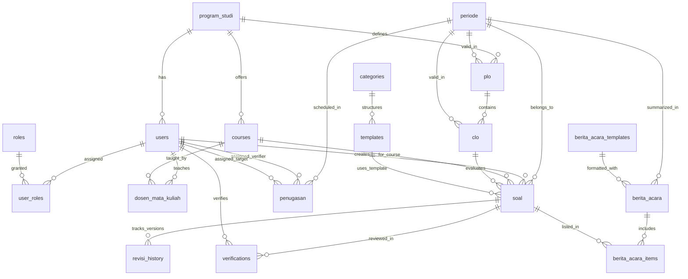

# Database Documentation

# Dashboard Verifikasi Soal Ujian - Database Architecture & Schema Specification

**Database Engine:** PostgreSQL (Version 14+)  
**ORM / Framework:** Laravel Eloquent  
**Charset & Collation:** UTF-8 / `utf8mb4_unicode_ci` (PostgreSQL standard UTF8)  
**Timezone:** Asia/Jakarta (WIB, UTC+7)  

---

## 1. Arsitektur & Konvensi Database

- **Primary Key:** `id` menggunakan tipe `BIGINCREMENTS` / `BIGINT` per-tabel transaction, didukung oleh `uuid` (UUID v4) unik pada tabel publik (`users`, `soal`) untuk mencegah penyelarasan ID acak (enumeration attack).
- **Soft Deletes:** Tabel-tabel utama (`users`, `soal`, `verifications`) memanfaatkan fitur Soft Delete Laravel (`deleted_at` timestamp) untuk menjamin integritas data audit akademik.
- **Foreign Keys:** Menggunakan `foreignId()` dengan constraint cascading (`cascadeOnDelete()` atau `nullOnDelete()`) sesuai keterikatan data master.
- **Audit Timestamps:** Seluruh tabel transaksi dilengkapi dengan `created_at` dan `updated_at`.

---

## 2. Tabel Master (Master Tables)

### 2.1 `users`
Menyimpan informasi data akun pengguna, dosen, coordinator, dan super admin.

| Nama Kolom | Tipe Data | Constraint | Deskripsi |
| :--- | :--- | :--- | :--- |
| `id` | BIGINT | PK, Auto Increment | Unique Identifier Utama |
| `uuid` | UUID | Unique, Not Null | Public Identifier UUID v4 |
| `kode_dosen` | VARCHAR(30) | Unique, Not Null | NIDN / Kode Dosen (Contoh: `DSN-SI-001`) |
| `nama_lengkap` | VARCHAR(150) | Not Null | Nama lengkap beserta gelar akademik |
| `email` | VARCHAR(150) | Unique, Not Null | Email resmi Telkom University |
| `password` | VARCHAR(255) | Not Null | Password terenkripsi Bcrypt / Argon2ID |
| `prodi_id` | BIGINT | FK -> `program_studi(id)` | Nullable jika Super Admin Fakultas |
| `tipe_dosen` | ENUM | 'biasa', 'lb' | Tipe Dosen (Biasa = Tetap, LB = Luar Biasa) |
| `semester_lb` | ENUM | 'ganjil', 'genap', Nullable | Menentukan periode keaktifan Dosen LB |
| `is_super_admin` | BOOLEAN | Default: `false` | Flag Super Admin |
| `is_coordinator` | BOOLEAN | Default: `false` | Flag Coordinator Prodi/Fakultas |
| `status_aktif` | BOOLEAN | Default: `true` | Status keaktifan akun pengguna |
| `last_login_at` | TIMESTAMP | Nullable | Timestamp login terakhir pengguna |
| `remember_token` | VARCHAR(100) | Nullable | Token sesi "Remember Me" |
| `created_at` | TIMESTAMP | Nullable | Waktu pembuatan akun |
| `updated_at` | TIMESTAMP | Nullable | Waktu pembaruan akun |
| `deleted_at` | TIMESTAMP | Nullable | Soft delete timestamp |

---

### 2.2 `roles` & `user_roles`
Menyimpan definisi peran (*roles*) tambahan dan pemetaan hubungan *many-to-many* antara `users` dan `roles`.

#### Tabel `roles`
| Nama Kolom | Tipe Data | Constraint | Deskripsi |
| :--- | :--- | :--- | :--- |
| `id` | BIGINT | PK, Auto Increment | ID Role |
| `nama_role` | VARCHAR(50) | Unique, Not Null | Nama Role (`super_admin`, `coordinator`, `dosen`, `pic`) |

#### Tabel `user_roles`
| Nama Kolom | Tipe Data | Constraint | Deskripsi |
| :--- | :--- | :--- | :--- |
| `id` | BIGINT | PK, Auto Increment | ID Pivot |
| `user_id` | BIGINT | FK -> `users(id)` | User terkait |
| `role_id` | BIGINT | FK -> `roles(id)` | Role terkait |
| `periode_id` | BIGINT | FK -> `periode(id)` | Nullable; menentukan batas periode peran (misal: PIC) |

---

### 2.3 `program_studi`
Menyimpan daftar Program Studi di lingkungan Fakultas.

| Nama Kolom | Tipe Data | Constraint | Deskripsi |
| :--- | :--- | :--- | :--- |
| `id` | BIGINT | PK, Auto Increment | ID Program Studi |
| `kode_prodi` | VARCHAR(10) | Unique, Not Null | Kode Prodi (Contoh: `SI`, `IF`, `TT`) |
| `nama_prodi` | VARCHAR(100) | Not Null | Nama lengkap Prodi (Contoh: `S1 Sistem Informasi`) |

---

### 2.4 `courses` (Mata Kuliah)
Menyimpan daftar Mata Kuliah per Program Studi.

| Nama Kolom | Tipe Data | Constraint | Deskripsi |
| :--- | :--- | :--- | :--- |
| `id` | BIGINT | PK, Auto Increment | ID Mata Kuliah |
| `kode_mk` | VARCHAR(20) | Unique, Not Null | Kode Mata Kuliah (Contoh: `CSI1A3`) |
| `nama_mk` | VARCHAR(150) | Not Null | Nama Mata Kuliah (Contoh: `Algoritma & Pemrograman`) |
| `prodi_id` | BIGINT | FK -> `program_studi(id)` | Foreign Key Program Studi pengampu |

---

### 2.5 `dosen_mata_kuliah`
Tabel relasi penugasan Dosen mengampu Mata Kuliah tertentu.

| Nama Kolom | Tipe Data | Constraint | Deskripsi |
| :--- | :--- | :--- | :--- |
| `id` | BIGINT | PK, Auto Increment | ID Pivot |
| `user_id` | BIGINT | FK -> `users(id)` | Dosen pengampu |
| `course_id` | BIGINT | FK -> `courses(id)` | Mata Kuliah yang diampu |

---

### 2.6 `periode`
Menyimpan data Periode Akademik (Semester & Tahun Akademik).

| Nama Kolom | Tipe Data | Constraint | Deskripsi |
| :--- | :--- | :--- | :--- |
| `id` | BIGINT | PK, Auto Increment | ID Periode |
| `nama_periode` | VARCHAR(100) | Not Null | Nama Periode (Contoh: `Semester Genap 2025/2026`) |
| `semester` | ENUM | 'ganjil', 'genap' | Jenis Semester |
| `tahun_akademik` | VARCHAR(20) | Not Null | Format: `2025/2026` |
| `tanggal_mulai` | DATE | Not Null | Tanggal awal pembukaan upload |
| `tanggal_deadline`| DATE | Not Null | Batas akhir upload & verifikasi |
| `status` | BOOLEAN | Default: `false` | `true` = Active, `false` = Inactive |

---

### 2.7 `plo` (*Program Learning Outcomes*)
| Nama Kolom | Tipe Data | Constraint | Deskripsi |
| :--- | :--- | :--- | :--- |
| `id` | BIGINT | PK, Auto Increment | ID PLO |
| `kode_plo` | VARCHAR(20) | Not Null | Kode PLO (Contoh: `PLO-01`) |
| `deskripsi` | TEXT | Not Null | Uraian Capaian Pembelajaran Lulusan |
| `prodi_id` | BIGINT | FK -> `program_studi(id)` | Foreign Key Prodi |
| `periode_id` | BIGINT | FK -> `periode(id)` | Foreign Key Periode |

---

### 2.8 `clo` (*Course Learning Outcomes*)
| Nama Kolom | Tipe Data | Constraint | Deskripsi |
| :--- | :--- | :--- | :--- |
| `id` | BIGINT | PK, Auto Increment | ID CLO |
| `kode_clo` | VARCHAR(20) | Not Null | Kode CLO (Contoh: `CLO-01`) |
| `deskripsi` | TEXT | Not Null | Uraian Capaian Pembelajaran Mata Kuliah |
| `plo_id` | BIGINT | FK -> `plo(id)` | Foreign Key PLO terkait |
| `periode_id` | BIGINT | FK -> `periode(id)` | Foreign Key Periode |

---

### 2.9 `categories` & `templates`

#### Tabel `categories`
| Nama Kolom | Tipe Data | Constraint | Deskripsi |
| :--- | :--- | :--- | :--- |
| `id` | BIGINT | PK, Auto Increment | ID Kategori |
| `nama_kategori` | VARCHAR(50) | Not Null | Kategori Soal (`UTS`, `UAS`, `Quiz`, `Remedial`) |
| `deskripsi` | TEXT | Nullable | Deskripsi kategori |

#### Tabel `templates`
| Nama Kolom | Tipe Data | Constraint | Deskripsi |
| :--- | :--- | :--- | :--- |
| `id` | BIGINT | PK, Auto Increment | ID Template Soal |
| `kategori_id` | BIGINT | FK -> `categories(id)` | Kategori Soal |
| `nama_file` | VARCHAR(150) | Not Null | Nama berkas template |
| `file_path` | TEXT | Not Null | Path penyimpanan berkas template |
| `versi` | UNSIGNED INT | Default: 1 | Nomor versi template |
| `is_active` | BOOLEAN | Default: `true` | Status keaktifan template |

#### Tabel `berita_acara_templates`
| Nama Kolom | Tipe Data | Constraint | Deskripsi |
| :--- | :--- | :--- | :--- |
| `id` | BIGINT | PK, Auto Increment | ID Template Berita Acara |
| `nama_template` | VARCHAR(100) | Not Null | Nama Template BA |
| `nama_file` | VARCHAR(150) | Not Null | Nama file template asli |
| `file_path` | TEXT | Not Null | Path file DOCX/Blade template BA |
| `is_active` | BOOLEAN | Default: `false` | Only 1 template active at a time |

---

## 3. Tabel Transaksi (Transaction Tables)

### 3.1 `soal`
Tabel utama penyimpanan data pengunggahan berkas soal ujian.

| Nama Kolom | Tipe Data | Constraint | Deskripsi |
| :--- | :--- | :--- | :--- |
| `id` | BIGINT | PK, Auto Increment | ID Transaksi Soal |
| `uuid` | UUID | Unique, Not Null | UUID Publik v4 |
| `dosen_id` | BIGINT | FK -> `users(id)` | Foreign key dosen pengunggah |
| `mata_kuliah_id` | BIGINT | FK -> `courses(id)` | Foreign key mata kuliah |
| `clo_id` | BIGINT | FK -> `clo(id)` | Foreign key CLO terkait |
| `periode_id` | BIGINT | FK -> `periode(id)` | Foreign key periode akademik |
| `template_id` | BIGINT | FK -> `templates(id)` | Foreign key template yang digunakan |
| `judul_soal` | VARCHAR(255) | Not Null | Judul Soal Ujian |
| `file_soal` | TEXT | Not Null | Path lokasi penyimpanan berkas PDF |
| `versi` | UNSIGNED INT | Default: 1 | Versi soal (di-increment tiap revisi) |
| `status` | ENUM | 'draft', 'submitted', 'in_review', 'revisi', 'approved', 'rejected' | Status Alur Verifikasi |
| `uploaded_at` | TIMESTAMP | Nullable | Timestamp saat dikirim (`submitted`) |

---

### 3.2 `revisi_history`
Menyimpan arsip riwayat versi berkas dan catatan revisi soal terdahulu.

| Nama Kolom | Tipe Data | Constraint | Deskripsi |
| :--- | :--- | :--- | :--- |
| `id` | BIGINT | PK, Auto Increment | ID History |
| `soal_id` | BIGINT | FK -> `soal(id)` | Foreign Key ke tabel Soal |
| `file_soal` | TEXT | Not Null | Path berkas versi sebelumnya |
| `versi` | UNSIGNED INT | Not Null | Angka versi revisi |
| `catatan` | TEXT | Nullable | Catatan perbaikan dari Dosen/PIC |
| `created_at` | TIMESTAMP | Default: Now | Waktu pengunggahan versi revisi |

---

### 3.3 `penugasan` (Assignment PIC)
Menyimpan penugasan Dosen PIC Verifikator terhadap Dosen Target dalam periode tertentu.

| Nama Kolom | Tipe Data | Constraint | Deskripsi |
| :--- | :--- | :--- | :--- |
| `id` | BIGINT | PK, Auto Increment | ID Penugasan |
| `periode_id` | BIGINT | FK -> `periode(id)` | Periode Akademik terkait |
| `verifier_id` | BIGINT | FK -> `users(id)` | Dosen yang menjadi PIC Verifikator |
| `target_dosen_id`| BIGINT | FK -> `users(id)` | Dosen yang soalnya akan diverifikasi |
| `assigned_by` | BIGINT | FK -> `users(id)` | Super Admin / Coordinator penugas |
| `assigned_at` | TIMESTAMP | Nullable | Waktu penugasan dibuat |

*Constraint Unik:* Composite Unique Index `(periode_id, verifier_id, target_dosen_id)` bernama `penugasan_unique_assignment`.

---

### 3.4 `verifications` (Verification Logs)
Menyimpan hasil peninjauan dan status keputusan dari PIC Verifikator.

| Nama Kolom | Tipe Data | Constraint | Deskripsi |
| :--- | :--- | :--- | :--- |
| `id` | BIGINT | PK, Auto Increment | ID Log Verifikasi |
| `soal_id` | BIGINT | FK -> `soal(id)` | Foreign Key Soal |
| `verifier_id` | BIGINT | FK -> `users(id)` | Foreign Key Dosen PIC Verifikator |
| `tipe_verifikator`| ENUM | 'pic', 'coordinator' | Jenis Verifikator (Default: `pic`) |
| `status` | ENUM | 'approved', 'revisi', 'rejected' | Status Keputusan |
| `catatan` | TEXT | Nullable | Catatan koreksi & rekomendasi perbaikan |
| `verified_at` | TIMESTAMP | Nullable | Waktu verifikasi dilakukan |

---

### 3.5 `berita_acara` & `berita_acara_items`

#### Tabel `berita_acara`
| Nama Kolom | Tipe Data | Constraint | Deskripsi |
| :--- | :--- | :--- | :--- |
| `id` | BIGINT | PK, Auto Increment | ID Berita Acara |
| `nomor_ba` | VARCHAR(100) | Unique, Not Null | Nomor BA Resmi (contoh: `BA/VERIF/2026/001`) |
| `periode_id` | BIGINT | FK -> `periode(id)` | Periode Akademik terkait |
| `verifier_id` | BIGINT | FK -> `users(id)` | Verifikator penanggung jawab BA |
| `generated_at` | TIMESTAMP | Nullable | Waktu otomatisasi BA dihasilkan |
| `file_pdf` | TEXT | Nullable | Path simpan berkas PDF hasil render |
| `file_docx` | TEXT | Nullable | Path simpan berkas DOCX hasil render |

#### Tabel `berita_acara_items`
| Nama Kolom | Tipe Data | Constraint | Deskripsi |
| :--- | :--- | :--- | :--- |
| `id` | BIGINT | PK, Auto Increment | ID Item BA |
| `berita_acara_id`| BIGINT | FK -> `berita_acara(id)` | Foreign Key Berita Acara |
| `soal_id` | BIGINT | FK -> `soal(id)` | Foreign Key Soal yang terangkum |

---

### 3.6 `broadcasts` & `notifikasi`

#### Tabel `broadcasts`
| Nama Kolom | Tipe Data | Constraint | Deskripsi |
| :--- | :--- | :--- | :--- |
| `id` | BIGINT | PK, Auto Increment | ID Broadcast |
| `title` | VARCHAR(255) | Not Null | Judul pengumuman |
| `message` | TEXT | Not Null | Isi pengumuman broadcast |
| `status` | ENUM | 'draft', 'published' | Status publikasi pengumuman |
| `created_by` | BIGINT | FK -> `users(id)` | Pembuat pengumuman |
| `published_at` | TIMESTAMP | Nullable | Waktu publikasi |

#### Tabel `notifikasi`
| Nama Kolom | Tipe Data | Constraint | Deskripsi |
| :--- | :--- | :--- | :--- |
| `id` | BIGINT | PK, Auto Increment | ID Notifikasi |
| `user_id` | BIGINT | FK -> `users(id)` | Penerima Notifikasi |
| `title` | VARCHAR(255) | Not Null | Judul Notifikasi |
| `message` | TEXT | Not Null | Isi Notifikasi |
| `type` | VARCHAR(50) | Default: 'info' | Tipe Notifikasi (`revisi`, `assignment`, `system`) |
| `is_read` | BOOLEAN | Default: `false` | Status dibaca |
| `read_at` | TIMESTAMP | Nullable | Waktu dibaca |

---

### 3.7 `activity_logs`
Tabel audit trail aktivitas pengguna di dalam sistem.

| Nama Kolom | Tipe Data | Constraint | Deskripsi |
| :--- | :--- | :--- | :--- |
| `id` | BIGINT | PK, Auto Increment | ID Activity Log |
| `user_id` | BIGINT | FK -> `users(id)` | Pengguna yang melakukan aksi |
| `action` | VARCHAR(100) | Not Null | Jenis aksi (Login, Upload Soal, Verify, Generate BA) |
| `description` | TEXT | Nullable | Detail rincian aksi |
| `ip_address` | VARCHAR(45) | Nullable | IP Address pengakses |

---

## 4. Entity Relationship Diagram (ERD Overview)

---

## 5. Indeks & Optimalisasi Performa Query

Untuk mendukung kecepatan query dashboard dan pencarian data berkapasitas besar, indeks berikut diimplementasikan di PostgreSQL:

1. **`users` Table:**
   - Index `users_email_unique` pada `email`
   - Index `users_kode_dosen_unique` pada `kode_dosen`
   - Index `users_prodi_id_index` pada `prodi_id`
2. **`soal` Table:**
   - Composite Index `soal_periode_status_index` pada `(periode_id, status)`
   - Composite Index `soal_dosen_periode_index` pada `(dosen_id, periode_id)`
   - Index `soal_uuid_unique` pada `uuid`
3. **`penugasan` Table:**
   - Composite Unique Index `penugasan_unique_assignment` pada `(periode_id, verifier_id, target_dosen_id)`
4. **`verifications` Table:**
   - Index `verifications_soal_id_index` pada `soal_id`
   - Index `verifications_verifier_id_index` pada `verifier_id`
5. **`berita_acara` Table:**
   - Index `berita_acara_nomor_ba_unique` pada `nomor_ba`
   - Index `berita_acara_periode_id_index` pada `periode_id`

---

## 6. Constraints & Database Business Rules

1. **Self-Verification Integrity Check:** Database & validation service memastikan `penugasan.verifier_id != penugasan.target_dosen_id` dan `verifications.verifier_id != soal.dosen_id`.
2. **Single Active Period Constraint:** Logika aplikasi menjamin hanya ada 1 baris di tabel `periode` yang memiliki `status = true`.
3. **Single Active BA Template:** Hanya 1 template di tabel `berita_acara_templates` yang berstatus `is_active = true`.
4. **Cascading Safety:** Pengapusan data master seperti `users` atau `soal` tidak menghapus log secara permanen melainkan menggunakan soft delete (`deleted_at`).
